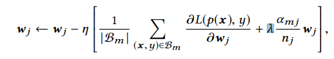

## DIN模型

原文：<a href="https://arxiv.org/pdf/1706.06978.pdf" style="text-decoration:none">Deep Interest Network for Click-Through Rate Prediction</a>

### 一、论文动机

此前的基于深度学习的CTR预估模型都是Embedding+MLP的架构，将离散的稀疏特征映射成一个低维稠密的向量，然后通过拼接形成一个固定程度的向量输入到MLP中学习非线性的特征。这样的问题在于用户的兴趣不止一个，所以很难通过一个固定长度的向量来表征用户丰富的兴趣。深度兴趣网络（DIN）设计了一个局部激活单元，从而能够从用户行为序列中调整和学习用户兴趣的表征。

### 二、模型结构

左边的模型是base model，它将用户行为序列中的物品embedding进行sum pooling，然后跟用户特征，候选物品特征，上下文特征拼接到一起，形成一个固定长度的向量，输入MLP中。

右边是DIN模型，它将用户行为序列中的物品的embedding和候选物品的embedding通过一个activation unit学习得到一个权重，然后进行加权的sum pooling，后面的操作跟base model无异。DIN并不是通过学习多个兴趣向量表征，那样会极大的增加参数，而是通过候选物品的不同，学习到一个不同的兴趣向量表征，可以通俗地理解为通过用户行为序列学习到对该候选物品的兴趣程度。

#### 2.1 特征的表示

每个group的特征都会有一个embedding lookup，比如第$i$个group的loopup表示为：

$D$表示embedding维度，$K_i$表示特征维度。

用户兴趣向量计算公式为：

$v_U(A)$表示用户$U$对候选物品$A$的兴趣，$w_j$表示用户行为序列中的第$j$个物品$e_j$与候选物品$v_A$通过activation unit计算出来的权重。

损失函数：

#### 2.2 两点训练的tricks

- Mini-batch Aware Regularization(MAR)

  为了避免过拟合，会加入L1正则项或者L2正则项，但是这样每次都会更新全部参数，这样极大地增加了计算压力。MAR技术是指只更新当前mini-batch中在出现过的特征的所对应的参数。以L2正则项为例，公式为：

  

  在mini batch中，等价于：

  

  B表示mini-batch的个数，$B_m$表示第$m$个mini batch。令$\alpha_{mj}=max_{(x,y)\in B_m}I(x_j \neq 0)$，则上式可以近似为：

  

  更新公式为：

  

- Data Adaptive Activation Function

  论文这里对常用的PReLU激活函数进行了改进。PReLU公式表示为：

  

  其中，$p(s)=I(s>0)$。

  对$p(s)$重新定义，设计出一种新的数据自调整（作用类似于BN，可以自动调整数据分布，避免过拟合）的激活函数Dice。

  

  

### 三、模型效果

数据集：

实验指标：改进过的AUC（gAUC）。

实验结果：

比较不同正则化手段的效果：

在阿里巴巴的数据集上的效果（AB测试效果）：

可视化：

### 四、结论

为了解决传统深度CTR模型用固定长度表征难以表征用户多层兴趣的瓶颈，提出DIN模型，在base model加入local activation unit，在训练技巧上为了避免过拟合提出了MBR以及Dice激活函数。DIN为用户行为序列的兴趣建模开辟了一条新的道路，已成功应用于阿里巴巴在线广告系统中。

