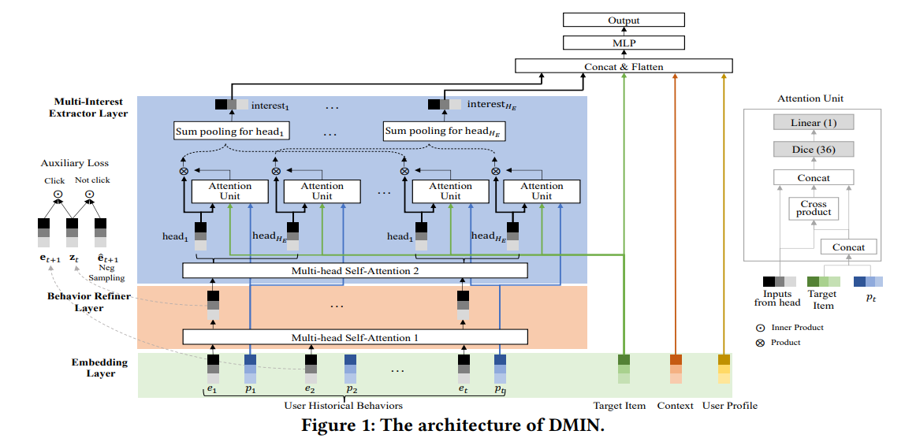
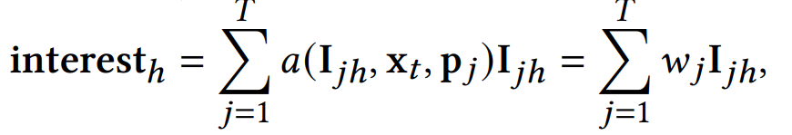

## DMIN模型

原文:<a href="https://dl.acm.org/doi/pdf/10.1145/3357384.3357814" style="text-decoration:none;">Deep Multi-Interest Network for Click-through Rate Prediction</a>

#### 一、论文动机

​       DIN模型和DIEN用于在用户行为序列中捕捉动态兴趣和兴趣演化。本文作者发现当潜在的关键兴趣发生改变时，用户的行为也会随着改变，因为提出DMIN模型以对潜在的多种兴趣进行建模和追踪。

​         DMIN模型包括两个部分，一个是行为重定义层，使用多头注意力机制捕捉更好的历史物品表示方式；另一个是多兴趣提取层，用以提取用户的多重兴趣。

#### 二、模型结构

- Embedding层：四类特征：用户信息，用户历史行为，上下文信息，目标物品。全部通过embedding变成低维稠密的向量，其中用户历史行为包括历史物品embedding和其位置编码。

- 行为重定义层：通过将历史物品和位置编码进行多头自注意力机制的计算，并辅以一个损失函数训练出更好的向量表示。

  

- 多重兴趣提取层：将行为重定义层训练出来的物品向量表示，通过多头自注意力机制得到在多个子空间下的物品向量表示，对于每个头，通过一个attention unit计算在该子空间内历史物品与目标物品之间的相关性，加权平均得到该子空间下的兴趣。

  

  

- MLP层：将捕捉到的多重兴趣和用户信息，目标物品，上下文信息等拼接后输入到MLP中，最终输出点击率预测结果。 

- 损失函数为对数损失函数：

  

#### 三、模型效果

实验数据集：

实验指标为AUC，在三个数据集上都有所提升，并且作者也对辅助损失函数和位置编码的有效性进行了验证。

#### 四、结论

DMIN对用户潜在多重兴趣进行建模以进行点击率的预测是有效的，其中多头注意力的设计是为了利用历史行为序列得到更好的物品向量表示。