## DMR模型

原文：<a href="[lvze92/DMR: Deep Match to Rank Model for Personalized Click-Through Rate Prediction (github.com)](https://github.com/lvze92/DMR)" style="text-decoration:none">Deep Match to Rank Model for Personalized Click-Through Rate Prediction</a>

### 一、论文动机

最近的CTR模型都是从用户行为数据中提取用户兴趣，之前的工作着重于用户的表征，但缺少对用户对物品的相关性建模。因此本文提出了深度匹配排序模型，即DMR模型。借鉴了协同过滤的召回思想，设计出了用户-物品网络和物品-物品网络，以计算用户-物品和物品-物品的相关性。

### 二、模型结构

模型的重点在于User-Item网络和Item-Item网络的设计。

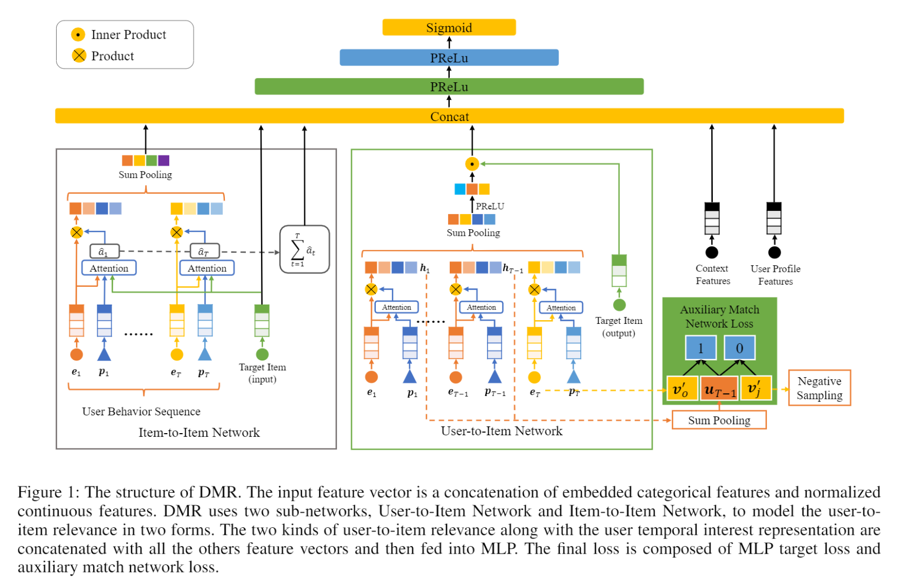

特征的表征：跟此前模型的处理一样，每个物品（用户）都有很多属性，每个属性的embedding拼接在一起，构成用户embedding和物品embedding。特征包括四类：用户文档$x_p$,用户行为$x_b$，目标物品$x_t$，上下文信息$x_c$，其中$x_b=[e_1;e_2;...;e_T]\in\R^{T\times d_e}$，$e_t$表示第$t$个用户行为特征向量，$d_e$是多个属性特征向量的拼接，$T$是用户行为长度。

- User-Item Network

  考虑到越近的行为越能反映用户近期的兴趣，所以需要给每个行为加权，但如果是简单的加权，很难确定权重的分布，因此用户-物品网络提出了对位置编码进行注意力计算，得到该行为的权重，计算公式为：

  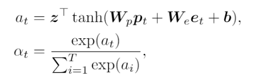

  其中，$p_t\in\R^{d_p}$是位置编码，$e_t\in\R^{d_e}$是第$t$个行为特征向量。需要训练的参数为$W_p\in\R^{d_h\times d_p},W_e\in\R^{d_h\times d_e},b\in\R^{d_h},z\in\R^{d_h}$。$\alpha_t$是正则化后第$t$个行为的权重，然后就可以进行加权sum pooling。最终的用户表征为：

  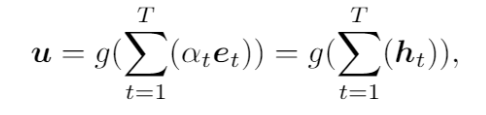

  其中，$u\in\R^{d_v}$

  对于目标物品的embedding是跟用户行为的embedding不共享的。目标物品的表征矩阵为$V'=[v'_1;v'_2;...,v'_K]\in\R^{K\times d_v}$，它是需要学习的，虽然增加了内存消耗，但是相比仅将共享的embedding矩阵的embedding size翻倍，模型的表达效果更好。

  用户和目标物品的相关性计算为：

  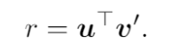

  为了更好的学习$V'$，模型提出了一个辅助子网络，将前$T-1$个行为计算得到的用户表征作为输入，第$T$个行为作为正样本，$V'$中的除第$T$个行为的embedding作为负样本（为减少计算量，采用负采样），辅助损失函数为：

  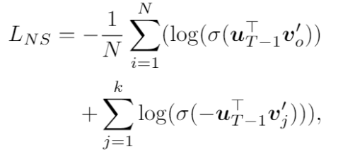

  最终的模型的损失函数为：

  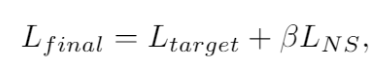

  其中，$\beta$为超参数，实验中取值为0.1，$L_{target}$为：

  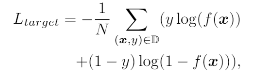

- Item-Item Network

  同样使用注意力机制计算行为物品和目标物品的相关性，计算公式为：

  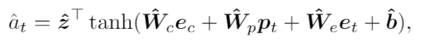

  其中，目标向量$\hat e_c\in\R^{d_e}$，位置编码$\hat p_t\in\R^{d_p}$,行为向量$\hat e_t\in\R^{d_e}$参数为$\hat W_c\in\R^{d_h\times d_e},\hat W_p\in\R^{d_h\times d_p},\hat W_e \in\R^{d_h\times d_e},\hat b\in\R^{d_h},\hat z\in\R^{d_h}$。相加得到行为序列与目标物品的相关性：

  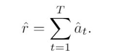

  正则化，然后对行为序列的物品进行加权sum pooling得到用户针对目标物品的兴趣表征$\hat u$。

  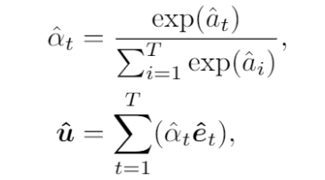

  这样将6部分特征拼接，输入到MLP中。$c=[x_p,x_c,x_t,\hat u,r,\hat r]$。

### 三、模型效果

数据集：淘宝的公开数据集和阿里巴巴推荐系统的工业数据集。

实验指标：AUC。

实验结果：

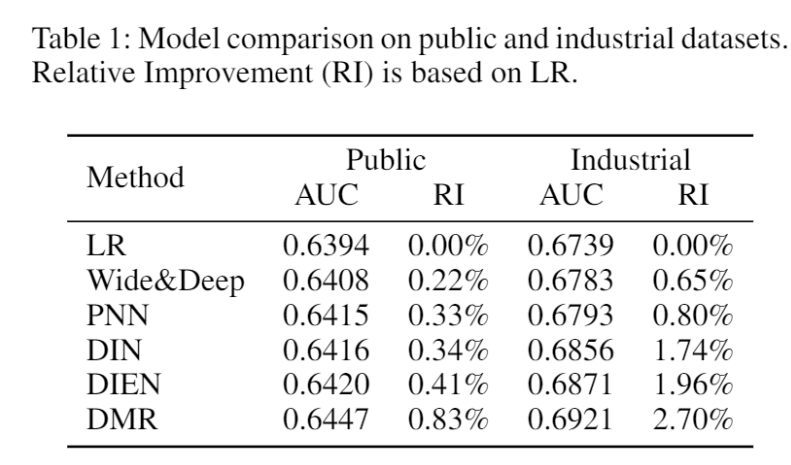

对于DMR各个模型有效性的验证：

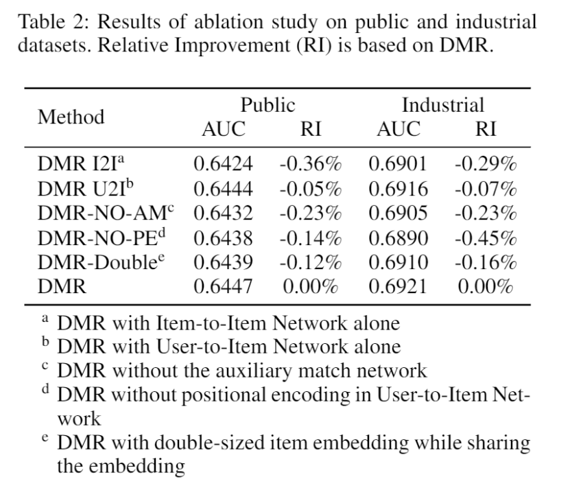

正负样本相关性、损失函数和位置编码相关性的可视化：

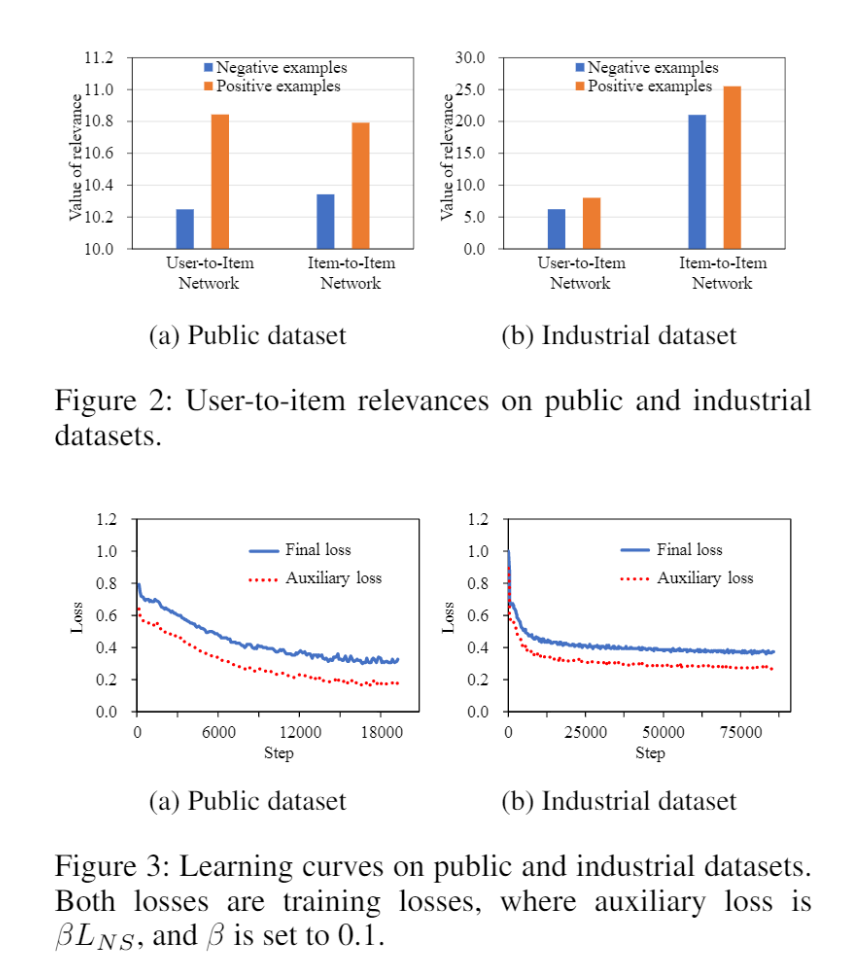

AB测试，DMR相比DIN，CTR提高5.5%，每个用户的点击次数提高12.8%。

### 四、结论

DMR是第一个将匹配和排序模块结合在一起的模型，它涉及了用户-物品网络和物品-物品网络计算用户和物品之间的相关性，成功应用于阿里巴巴的线上推荐系统。