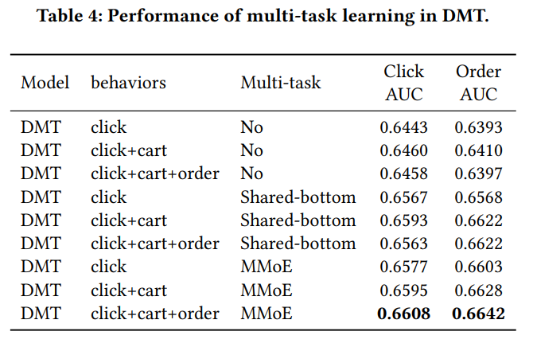

## DMT模型

原文:<a href="https://dl.acm.org/doi/pdf/10.1145/3340531.3412697" style="text-decoration:none">Deep Multifaceted Transformers for Multi-objective Ranking in Large-Scale E-commerce Recommender Systems</a>

### 一、论文动机

现存的推荐算法基本上都是从用户历史点击行为序列中预测用户点击率，并根据预测的点击率作为打分进行排序。本文提出一个利用用户多行为序列进行多任务学习的模型，即DMT模型，它使用多个transformer对用户多个行为序列进行建模，下游使用MMOE模型进行多任务建模。

### 二、模型结构

模型有三个特点：多目标排序、多序列建模、偏置的隐式反馈。

2.1 Input and Embedding layers

输入数据类型分为categorical features和dense features，其中categorical features构成了不同的行为序列，dense features是京东之前使用的GBDT使用的615个连续特征，主要包含物品文档特征（点击次数、CTR、CVR、rating），用户文档特征（购买力、喜欢的类别和品牌），用户-物品的匹配特征（物品是否匹配用户的性别或者年龄），以及用户-物品交互特征（在一个时间窗口内对同类型的点击次数）。categorical features进行embedding处理，dense features进行z-score归一化。

2.2 DMT layers

三个行为序列：用户7天内的点击过的50个产品序列（短期兴趣）、最近的10个加入购物车或收藏的行为序列（中期兴趣）、一年内购买的产品序列。

每个序列对应一个transformer，encoder负责对序列进行特征提取以及重新编码，decoder输入的目标物品的embedding，计算其与序列中各物品的注意力分数，最终输出的是用户序列提取出来的兴趣。

2.3 MMOE layers

将得到的三个兴趣向量、目标物品的embedding以及归一化后的dense features拼接在一起，输入到MMOE模型中。

MMOE的输入首先会分别输入多个expert网络（本质上是MLP），然后根据任务的数量设置同等数量的gate，计算每个任务下每个expert网路输出向量的权重，加权平均后输入到utility network。本文还对用户的隐式反馈用一个bias DNN建模，最终每个utility network的输出加上bias DNN的输出，得到各个任务的输出。

- 训练时：

  $y_k = \sigma(u_k + y_b)$

  $L_k = -\frac{1}{N} \sum^N_{i=1}(y_ilogy_k+（1-y_i)log(1-y_k))L_k$

  $L = \sum^N_{i=1}\lambda_k L_k$

  其中，$y_k$表示第k个任务，$y_b$表示bias DNN的输出，$u_k$表示第$k$个utility network的输出。

- 预测时：

  $\hat{y_k}=\sigma(u_k)$

  $\hat{y}=\frac{\sum^N_{k\in1}w_k\hat{y_k}}{\sum^N_{k\in1}w_k}$

  根据$\hat{y}$进行排序。

### 三、模型效果

实验数据集：京东推荐系统上一周的数据。

实验目标：Click Prediction和Order Prediction

实验指标：AUC、RelaImpr、Precision@4和MRR@4。

实验结果：

探讨了transformer位置编码不同方式的效果：

探讨了多序列和多任务学习的效果：

探讨了不同类型偏差的效果：

### 四、结论

本文第一次提出使用多序列建模捕捉用户不同兴趣，以及使用MMOE进行多任务学习进行排序，相比京东之前的GBDT有了巨大幅度的提升。