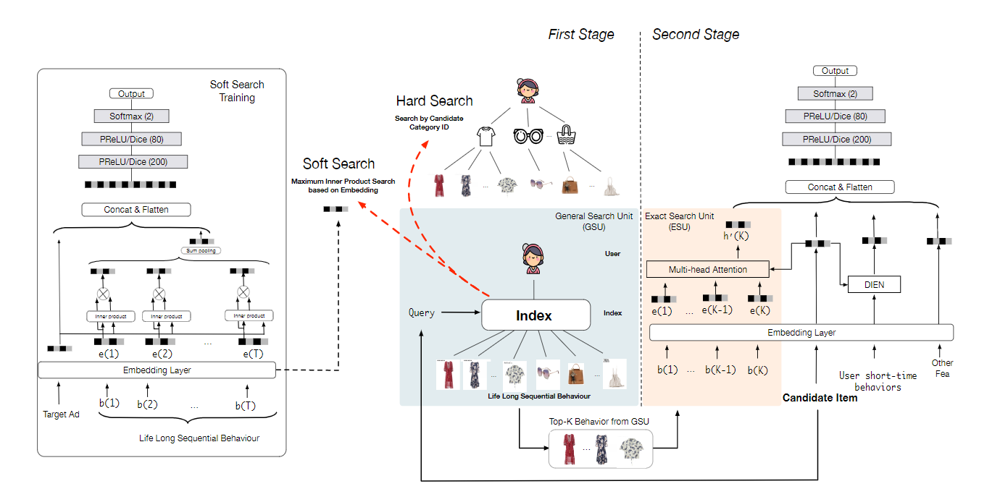
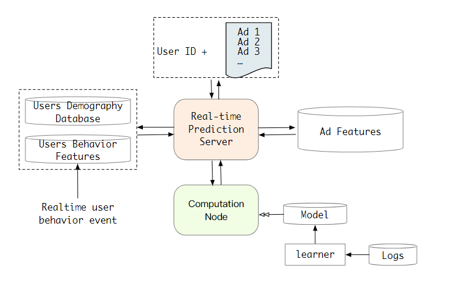
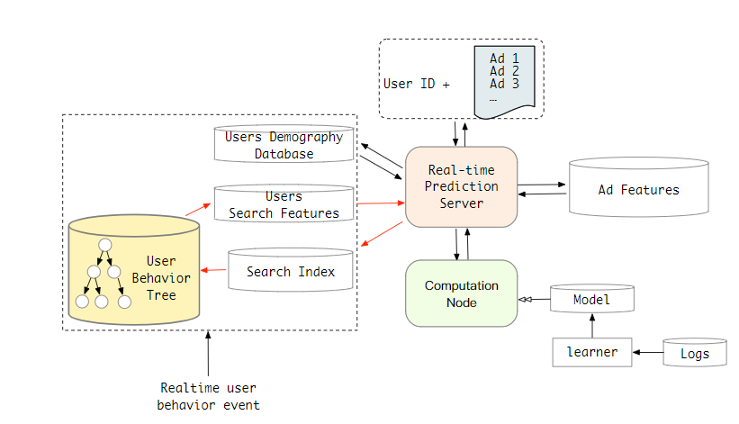
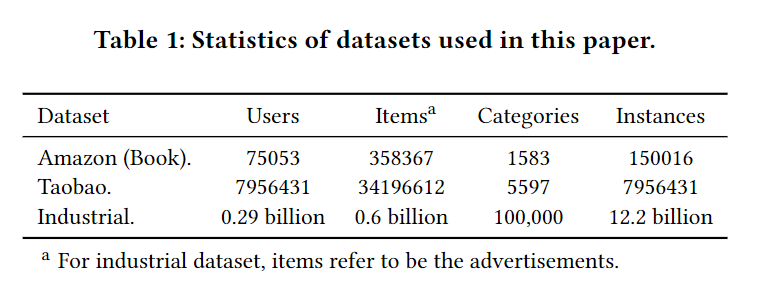
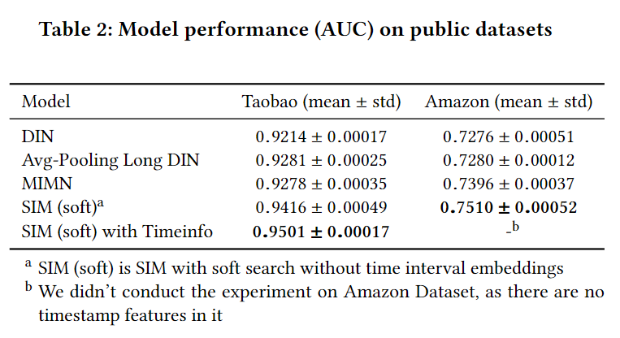
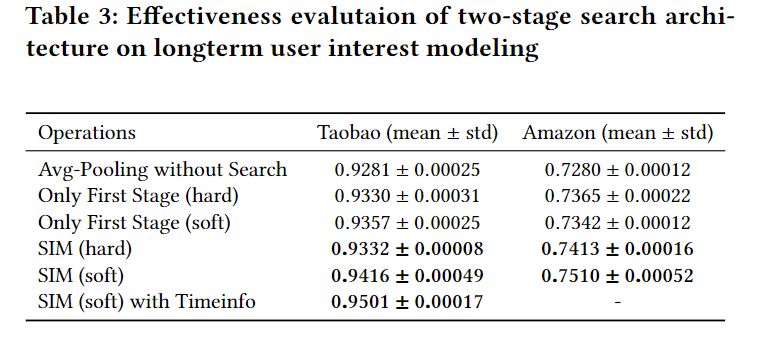
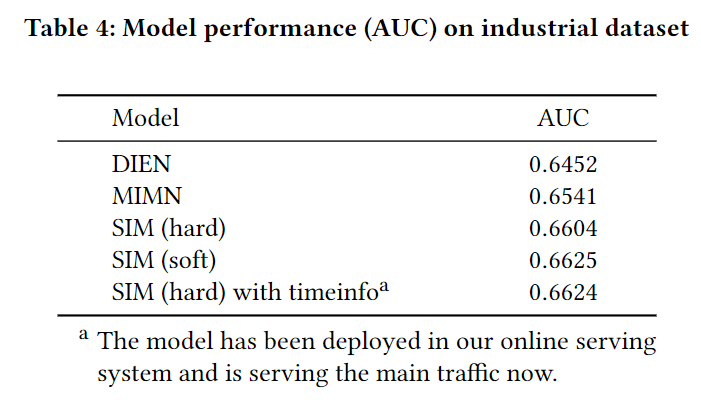

## SIM模型

原文:<a href="https://arxiv.org/pdf/2006.05639.pdf" style="text-decoration:none;">Search-based User Interest Modeling with Lifelong Sequential
Behavior Data for Click-Through Rate Prediction</a>

### 一、论文动机

用户的行为序列对于点击率预测具有非常重要的价值，MIMN是最新的针对行为序列建模的模型，它使用记忆网络使得建模的用户行为序列长度可以达到1000条。然而，如果如果序列长度再增加10倍，那么MIMN就不能准确地捕捉对候选物品的兴趣。本文提出一种基于搜索的兴趣模型，即SIM，它可以对更长的历史行为序列进行建模（最长可以达到54000）。该模型进行两阶段的搜索，分别是泛化搜索单元（GSU)和精确搜索单元（ESU）。

### 二、模型结构

#### 2.1 GSU

左边是GSU，主要的思想就是通过找出与目标物品(来自于长期历史行为序列)相似度最高的K个行为，从而把长序列变成短序列。有两种方式可以实现这一目标。

- hard-search

  通过找出历史行为序列中与目标物品类型一致的行为，从而把长序列变短。这种方法很简单直接，而且很适用于线上服务。

- soft-search

  通过训练一个辅助的CTR模型，得到各历史行为的embedding和目标物品的embedding，找出K个用户行为的embeding与目标物品embedding内积最大的用户行为。

#### 2.2 ESU

 右边是ESU，将GSU得到的K个历史行为通过多头自注意力捕捉用户的多种兴趣。head的输入包含行为的表征和以及各历史行为与目标物品的时序信息表征。一个head的兴趣的计算是通过该head得到的行为表征的加权平均得到的(权重的计算是行为表征与候选物品的内积得到的)。捕捉用户的短期行为可以用DIEN，最终将长期的多兴趣表征、短期兴趣表征、候选物品embedding以及其他特征输入到MLP种，从而得到CTR预测结果。

整个模型的损失函数为：

当GSU采用hard-search时，$\alpha$为0；当采用soft-search时，$\alpha$和$\beta$都为1。

### 三、线上服务的实现

起初阿里巴巴线上实时预测CTR的广告系统流程是这样的：

包含两部分：计算节点和预测服务器。

当用户行为数据特别多时，实时预测系统的延迟和存储会受到很大的挑战。采用了SIM后的线上服务系统如下：

采用的是hard-search，包含两级索引。第一级索引是用户id，第二级索引是类别id，通过两级索引，便可以找到与目标物品同类别的物品。

### 四、模型效果

实验数据集：

在公开数据集上的效果：

验证两阶段搜索架构的有效性：

在工业数据集上的效果：

### 五、结论

提出了可以对上万级别长度的行为序列进行建模的两阶段搜索兴趣模型，并成功应用于阿里巴巴的广告系统，取得了巨大的收益，并指出未来要建立针对指定用户的长行为序列兴趣模型。