## TIEN模型

原文：<a href="https://dl.acm.org/doi/pdf/10.1145/3340531.3411952" style="text-decoration:none">Deep Time-Aware Item Evolution Network for Click-Through Rate Prediction</a>

### 一、论文动机

​        以往的对用户兴趣建模的CTR模型都是通过用户的历史行为序列进行建模的，但用户的偏好是会发生变化的，比如有的物品因为促销活动等原因导致激发了用户的新的兴趣，而这是无法从用户过去的行为序列中得到的，所以就是了TIEN模型，它是一个时间感知的物品演化模型。

### 二、模型结构

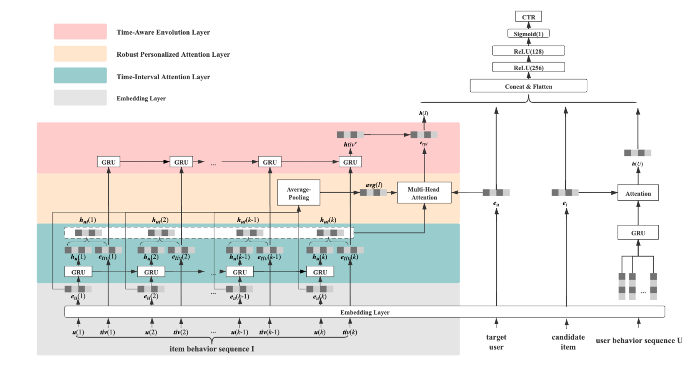

模型的输入包含四部分，分别是用户$u$，候选物品$i$，用户行为序列$I_u$，物品行为序列$U_i$。用户行为序列即用户交互过的物品，按照时间先后的排序结果；物品行为序列则是与该物品交互过的用户（用户特征）按照时间先后的排序结果。

用户特征：用户ID，性别，年龄段等等。

物品特征：物品ID，店铺ID，品类ID等。

用户行为序列中每一个物品会转换为对应的特征表示，而物品行为序列中每一个用户也会转换成对应的特征表示。

模型对物品行为序列的建模包含四个部分，分别是Embedding layer，Time-Interval Attention Layer，Robust Personalized Attention Layer，Time-Aware Evolution Layer。

-  Embedding Layer

  物品和用户特征会转换成为各自的embedding，分别用$e_u$和$e_i$表示。

  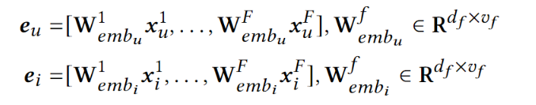

  用户行为序列中的每一件物品特征转成对应的embedding，用$S_u$表示，物品行为序列中每一个用户特征也转换成对应的embedding，用$S_i$表示。

  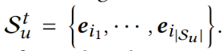

  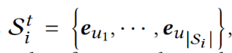

- Time-Interval Attention Layer

  $tiv(k)$表示在当前请求时刻$t$与物品行为序列中第K个用户与该物品交互时间的时间间隔。将时间间隔进行分段，[0,1),[1,2),[2,4),....,[$2^j,2^{j+1}$)，找到$tiv(k)$对应的分段，便可以把它变成离散的特征，用$x_{tiv(k)}$表示，然后转换对应的embedding表示：

  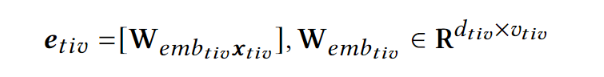

  同时通过GRU对物品行为的演化过程进行建模，将每个时间步GRU的hidden state表示为$h_{uk}$，并把时间间隔作为权重，与$h_{uk}$进行element-wise相加融合，得到$h_{utk}$。

  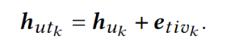

- Robust Personalized Attention Layer

  实现两个目标：过滤物品序列中的噪声以及从物品行为序列中找到与当前用户相似的用户。

  第一个目标实现：将embedding layer物品行为序列中的各个用户embedding继续average pooling，然后与当前用户的embedding进行相加。

  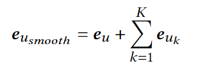

  第二个目标实现：用注意力机制，计算公式如下：

  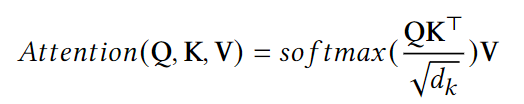

  其中$Q$是$e_{u_{smooth}}$,$K$是融合了时间间隔的$h_{ut(k)}$，$V$是没有加入时间间隔的物品行为序列中用户的embedding，即$h_{uk}$。

  经过多头注意力机制的计算，最终输出$e_{rpi}$。

  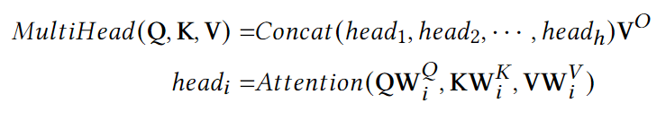

  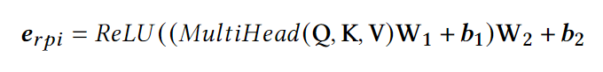

- Time-aware Evolution Layer

  建模物品的潮流趋势，或者生命周期。做法是将时间向量输入到GRU中。

  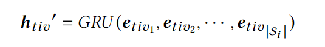

  再将此输出与Robust Personlized Attention Layer的输出$e_{rpi}$进行融合，得到最终的物品行为序列的向量表示，融合的方式有element-wise相加，相乘或者更加复杂的非线性方式等等。

个人总结：判断用户会不会与该物品产生交互，对于物品行为序列建模给出了两个重要信息，一个是当前用户与跟该物品有过交互的用户之间的相似度（多头注意力计算得到），另一个是当前物品在当下的受欢迎程度（通过时间间隔建模）。

用户行为序列的做法跟之前的模型类似，最终将当前用户的向量表示，候选物品的向量表示，用户行为序列的向量表示，物品行为序列的向量表示进行拼接，输入到MLP中，最终得到CTR预测结果。（下游任务还可以是CVR，GMV，Price预估等）。

如果是CTR预测任务，使用的损失函数为：

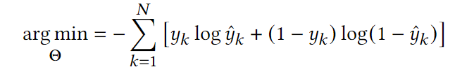

### 三、模型效果

实验数据集：

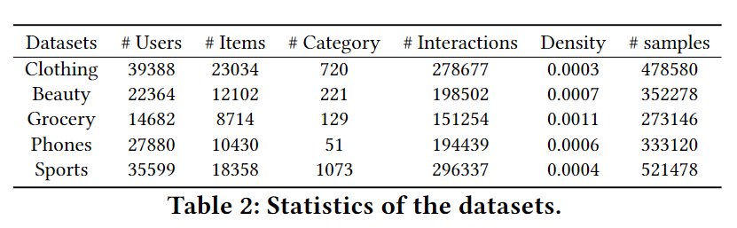

实验指标AUC，对比实验结果：

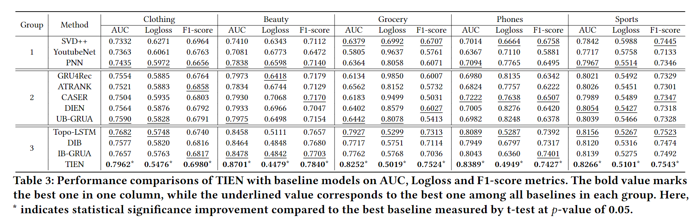

验证TIEN中各个layer的有效性：

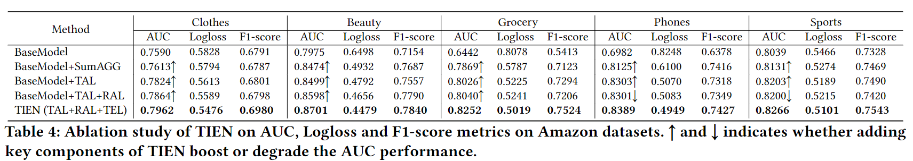

研究物品行为序列的长度：

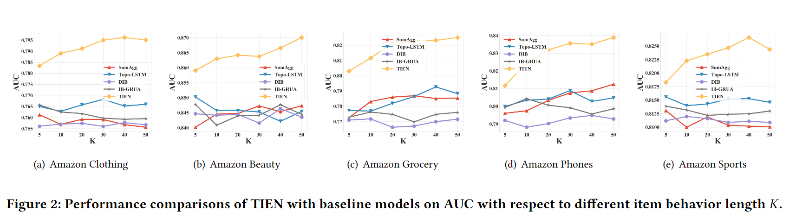

### 四、结论

创新点在于首次对时间感知的物品行为进行建模，在现实的数据集上取得了比STOA更好的效果。