## ComiRec模型

原文：<a href="https://arxiv.org/pdf/2005.09347.pdf" style="text-decoration:none">Controllable Multi-Interest Framework for Recommendation</a>

### 一、 论文动机

此前的工作主要是通过用户行为序列从而学习一个用户的embedd-ing，然而只通过一个embedding很难描述用户的多兴趣，因此提出了一种用于序列化推荐的可控的多兴趣推荐框架，即ComiRec。该模型可以从大规模的物品池中检索出候选物品。

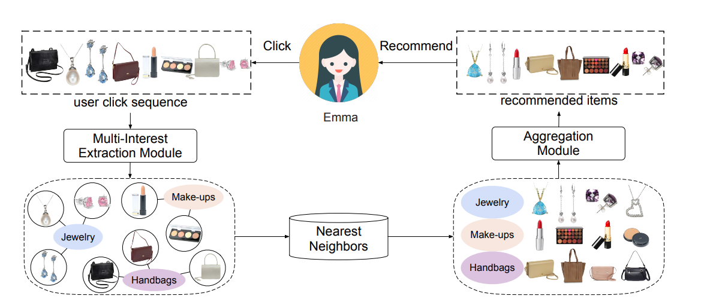

### 二、模型结构

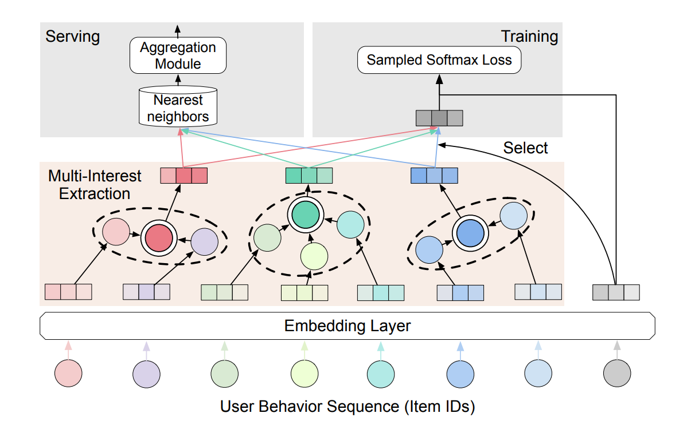

1. Multi-Interest Extraction Module

   将用户行为序列中的物品ID进行embedding，然后通过多兴趣抽取模块学习出表征多个兴趣的向量。有很多方法可以实现这一目的，论文中介绍了两种，分别是动态路由（ComiRec-DR）和自注意力（ComiRec-SA）。

   - 动态路由

     想法来自于胶囊网络。在胶囊网络中，每个神经节点的输入和输出都是向量。假设胶囊$i$是上一层的，下面给出计算下一层的第$j$个胶囊的过程。

     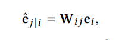

     $W_{ij}$是转移矩阵。胶囊$j$的输入为：

     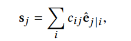

     对于$c_{ij}$的计算如下：

     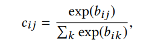

     胶囊$j$的输出是：

     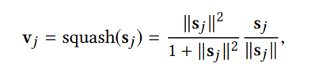

     当$||s_j||$很大时，$v_j$长度趋近于1；当$||s_j||$很小时，$v_j$长度趋近于0。

     最后一层的胶囊节点有K个，就表示有K个兴趣的表征，表示为$V_u=[v_1,...,v_K]\in \R^{d\times K}$。

     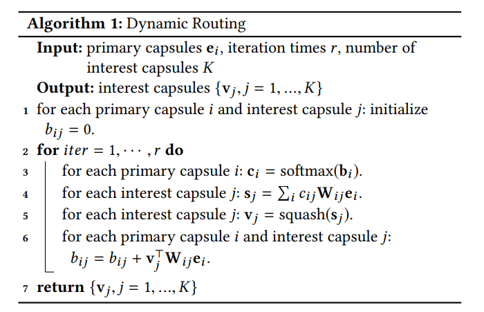

   - 自注意力

     用户行为序列为$H\in\R^{d\times n}$，$n$是序列长度，$d$是物品ID的embedding长度，通过自注意力机制学到权重向量$a\in\R^n$：

     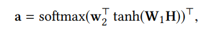

     其中，$W1$和$w_2$为学习的参数，维度分别为$d_a \times d$和$d_a$。

     进行多次自注意力计算，就可以得到兴趣矩阵$V_u$。

     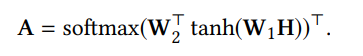

     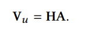

   模型训练：

   目标物品$i$的embedding和兴趣的矩阵通过argmax操作得到该目标物品对应的用户向量表示：

   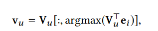

   计算用户$u$会与物品$i$产生交互的概率：

   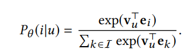

   目标函数：

   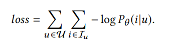

   线上服务：

   根据用户多兴趣向量，通过近邻查询，为每个兴趣检索N个最近的向量，从而得到$K\times N$个物品，然后通过aggregation module再选择出Top-N的物品。

2. Aggregation Module

   从$K\times N$个物品中选择出N个的直接有效的办法是通过一下函数计算并过滤:

   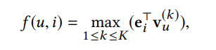

   这样子做保证了准确度，但在多样性上表现不足。所以通过以下函数从$K \cdot N$的候选集$M$中选择出最终的Top-N的召回集合$S$:

   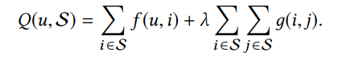

   其中：

   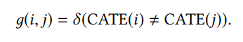

   $\lambda$是一个多样性的可控因子，当$\lambda=0$时，不考虑多样性；当$\lambda=\infin$时，该模块着重考虑多样性。

   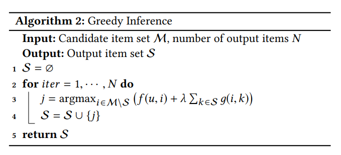

### 三、模型效果

实验数据集：

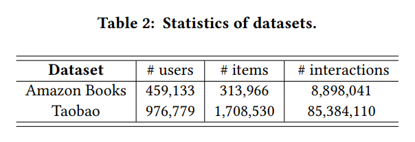

实验指标：Recall@N, Hit Rate@N, NDCG@N。

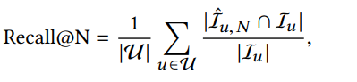

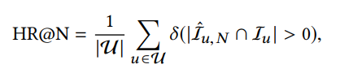

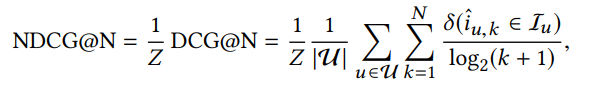

实验结果：

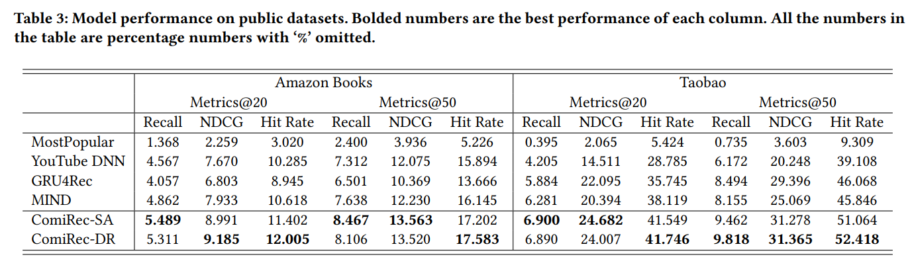

比较超参数兴趣的个数K不同取值的效果：

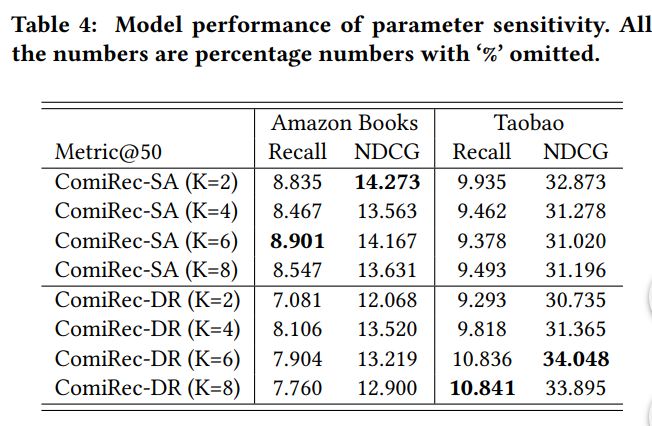

比较不同超参数多样性权重$\lambda$不同取值的效果：

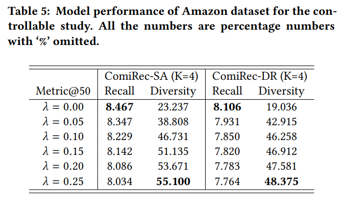

#### 四、结论

提出了一种新型的可控的多兴趣召回框架，并在两个数据集上取得了改进的效果，也成功应用于阿里巴巴的分布式云平台中。未来将引入记忆网络捕捉用户的兴趣演化和感知理论以便对用户更好的建模。