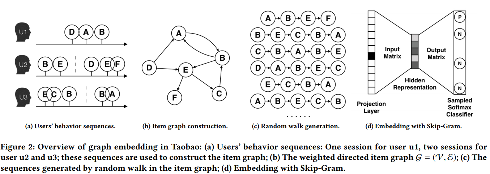

## EGES模型

### 一、论文动机

淘宝推荐系统面临三大难题：延展性、稀疏性和冷启动。本文提出了一种针对这三个问题的基于图嵌入框架的模型。从用户行为序列中构建图，同时把物品的side information加入进来，进行embedding的学习，本文也提出了两种针对side information的融合方法。

### 二、模型结构

- 构建图：分session，建立有向带权图
- random walk: 采样序列
- skip-gram：学习embedding

使用graph embedding与CF的区别：CF只考虑共现次数，graph embedding可以学习更高阶的相似度。

2.1 BGE（原始的方法）

$M_{ij}$为权重。

优化目标为：

负采样：

2.2 加入side information

用于冷启动的关键一步。为物品的每个side information（比如category\brand\price）建立一个embedding matrix，加上item自身的embedding matrix。假设有$n$个side information, 那么对于item$v$来说，有$n+1$个向量，分别是$W_v^0,...,W_v^n\in\R^d$，$d$是embedding的维度，接下来就是融合了，采用平均融合。

$H_v$即为item的embedding。通过skip-gram训练。

2.3 EGES

为side information的融合学习权重，采用加权融合。

损失函数：

伪代码：

### 三、模型效果

数据集：

评价指标：AUC

效果：

线上A/B测试：

验证冷启动：新物品用其side information的平均作为其embedding，然后进行内积检索最近邻。

可视化：

系统架构：

### 四、结论

用图嵌入加上side information的方法解决了淘宝十亿级数据量的推荐系统出现的延展性、稀疏性、冷启动难题。未来大的研究方向有二，一是利用注意力机制；二是加入文本信息。