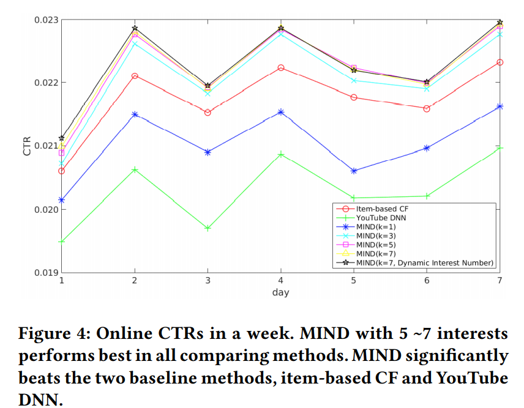

## MIND模型

原文:<a href="https://arxiv.org/pdf/1904.08030.pdf" style="text-decoration:none">Multi-Interest Network with Dynamic Routing for Recommendation at Tmall</a>

### 一、论文动机

工业上的推荐系统包括召回和排序两个阶段。召回阶段的目的是从海量的物品中找出符合用户兴趣的候选物品，排序阶段是将这个候选物品根据用户兴趣进行排序。由此可见，无论是召回还是排序，对于用户兴趣的表征是至关重要的。此前很多的工作都是用一个向量表征用户的兴趣，实际上这难以有效刻画用户的多重兴趣。本文提出了基于动态路由的多兴趣表征模型，即MIND模型。

### 二、模型结构

模型的创新点在于多兴趣提取层和标签感知的注意力层。

2.1 问题定义

模型输入可以用一个三元组表示：$(I_u,P_u,F_i)$。$I_u$表示用户交互过的物品集合，$P_u$表示用户信息，$F_i$表示目标物品的特征。

用户信息通过embedding得到各特征的向量表示，拼接再一起构成用户embedding，用$\vec{p_u}$表示。所有物品的信息（id类特征）的embedding通过平均池化，形成物品的embedding，用$E_u=\left\{\vec{e_j},j\in I_u \right\}$，目标物品用$\vec{e_i}$。

2.2 多兴趣抽取层

对一般动态路由算法进行三点改进：

- 一般的路由算法将上一层的胶囊与下一层的胶囊之间的特征转换矩阵都是不一样的，而MIND模型使用一个共享特征转换矩阵。

- 同时，一般的路由算法将胶囊之间权重初始化为0，又因为我们使用了共享矩阵，这样就会导致每个胶囊的输出（即每个兴趣向量）都是一样的。

- 每个用户的行为序列长度不一，兴趣个数也应当不同，提出自适应的兴趣数目，具体计算方式为：

  

B2I路由算法：

2.3 标签感知的注意力层

注意计算公式为：

key和value向量都是兴趣向量，而query向量是目标物品的向量。

参数$p$用于调整注意力的分布。

2.4 训练 & 线上

经过注意力层计算得到用户向量$\vec{v_u}$，计算与目标物品$\vec{e_i}$的交互概率。

目标函数：

训练后，就找到了用户表征的函数$f_{user}$，只要我们将用户信息和用户行为物品输入到$f_{user}$就可以得到多个表征用户兴趣的向量，通过最近邻查找便可以找到Top-N物品进行召回。

### 三、模型效果

数据集：

指标：命中率（HR@N)

实验结果：

在亚马逊图书数据集上进行超参取值的比较，调整注意力分布$p$和动态路由算法$b_{ij}$的初始化分布。

线上实验：

线上实验表明，MIND模型能够有效提高CTR。

### 四、结论

提出了一种用于召回阶段的用户多兴趣表征模型，在离线数据集上取得了很好的效果，同时线上的结果也表明MIND模型能够有效提高CTR。未来的工作方向有二：整合更多的用户信息，比如行为时间等；参考K-means++初始化范式，优化动态路由的初始化范式。

