## NCF模型

原文：<a href="https://arxiv.org/pdf/1708.05031.pdf" style="text-decoration:none">Neural Collaborative Filtering</a>

### 一、论文动机

协同过滤是个性化推荐技术中用以刻画用户对物品的偏爱程度的方法。矩阵分解是协同过滤中一种最流行的方法，它的思想是为用户和物品学习一个隐因子向量。本文提出一种基于神经网络进行协同过滤的模型，即NCF模型。

### 二、模型结构

一般的神经协同过滤框架：

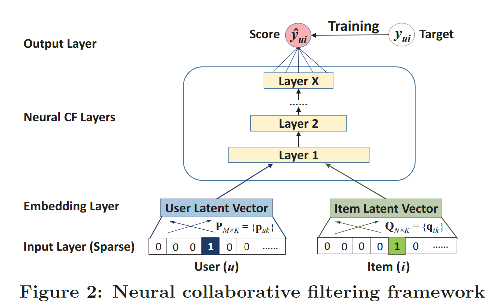

学习的函数：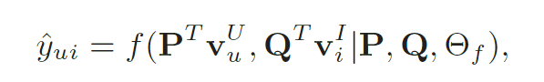

当成回归问题，损失函数为：

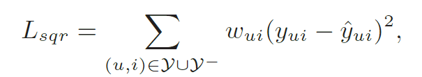

其中$w_{ui}$是超参数，表示样本的权重。

当成二分类问题，损失函数为：

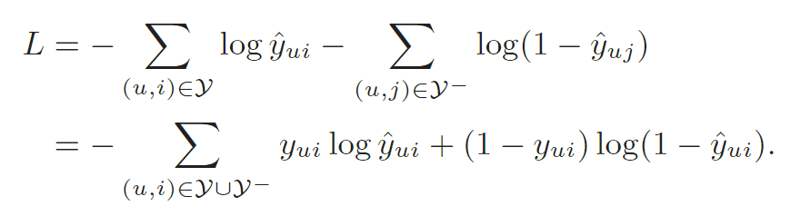

基于上面的框架，本文设计的模型NeuMF（模型融合），包括两个部分，左半部分是体现了广义上的矩阵分解，右半部分使用了MLP学习用户和物品的交互函数。

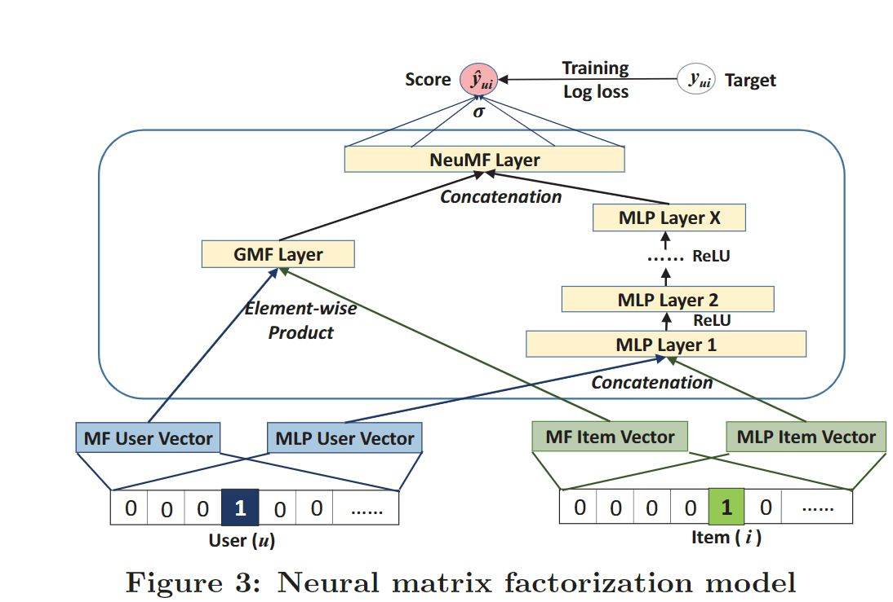

- GMF的计算：

  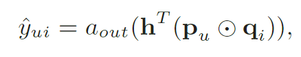

  其中，$a_{out}$表示激活函数，$h$是权重参数，$p_u$和$q_i$表示用户和物品的embedding，$\bigodot$表示对应元素相乘，结果是一个向量。

- MLP的计算：

  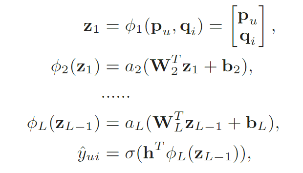

  将用户和物品的embedding进行拼接，然后输入MLP中。

综合起来，结果为：

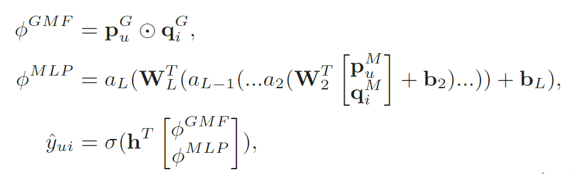

GMF和MLP有各自的embedding。

### 三、模型效果

数据集：

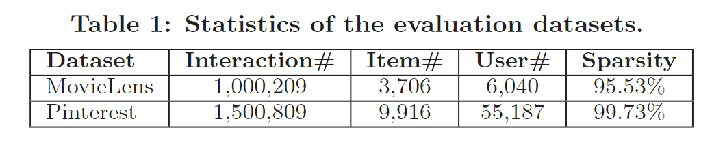

实验指标：HR@N和NDCG@N

基准模型：

- ItemPop：根据热度召回（交互次数最多），非个性化推荐
- ItemKNN：ItemCF
- BPR
- eALS

实验结果：

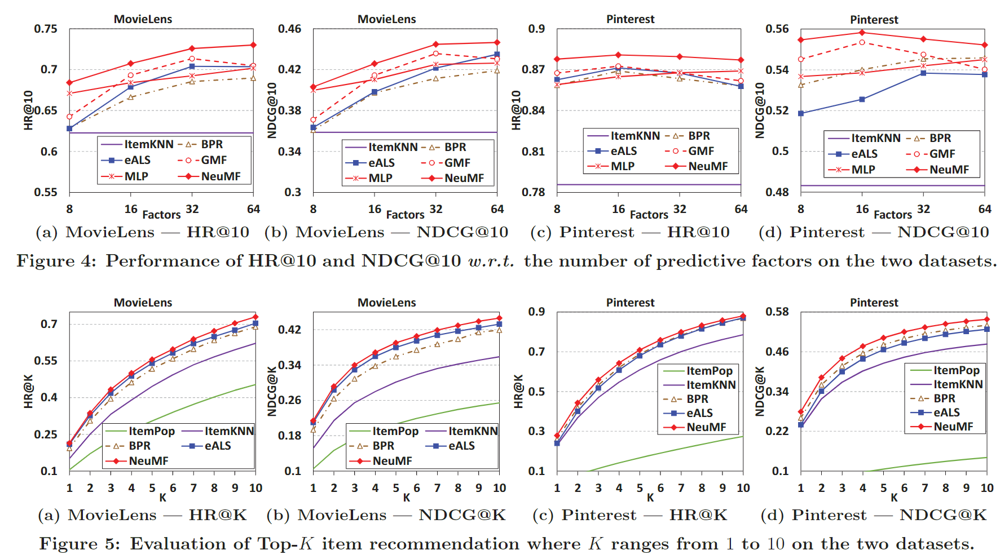

比较预训练和没有预训练的性能：

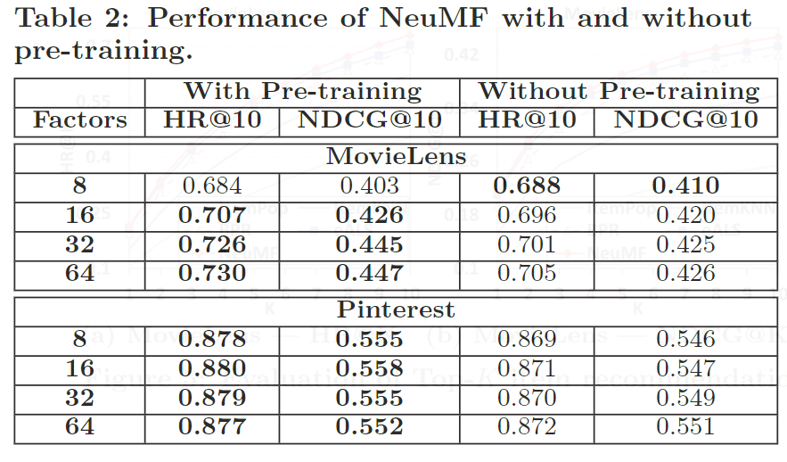

从loss和正负样本比的角度分析：

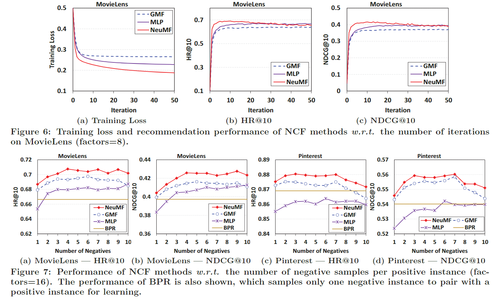

验证MLP的层数加深的有效性：

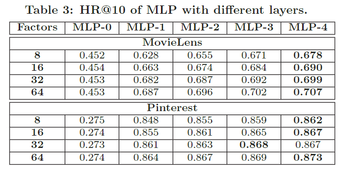

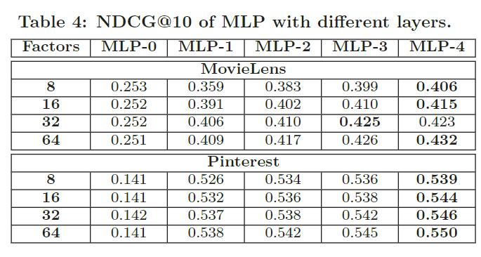

### 四、结论

提出了基于神经网络的协同过滤框架NCF，并基于此框架提出三种具体的模型结构，GMF、MLP和NeuMF，其中NeuMF是前两者的融合模型。未来将NCF框架拓展到对辅助信息，比如评论，时间信号等的建模。