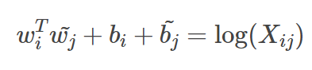

## 算法岗位面试题目及知识总结

### <u>C++</u>

1. c++中指针和引用的区别（2020字节跳动）

   * 指针：指针是一个变量，只不过这个变量存储的是一个地址，指向内存的一个存储单元；而引用跟原来的变量实质上是同一个东西，只不过是原变量的一个别名而已
   * 可以有const指针，但是没有const引用
   * 指针可以有多级，但是引用只能是一级
   * 指针的值可以为空，但是引用的值不能为NULL，并且引用在定义的时候必须初始化
   * 指针的值在初始化后可以改变，即指向其它的存储单元，而引用在进行初始化后就不会再改变了（绑定在一起）
   * "sizeof引用"得到的是所指向的变量(对象)的大小，而"sizeof指针"得到的是指针本身的大小
   * 指针和引用的自增(++)运算意义不一样

2. 如果实现c++中的vector，只需push_back和查找两个功能，底层如何实现（2020字节跳动）

   解答：用一个数组，不够就定义一个更大的，复制过去；查找可以顺序查找

   ​           更快的方法：二叉查找树
   
3. unordered_map、map优缺点

   - map

     - 优点：

       （1）有序性，这是map结构最大的优点，其元素的有序性在很多应用中都会简化很多的操作。

       （2) 红黑树，内部实现一个红黑树使得map的很多操作在O(logn)的时间复杂度下就可以实现，因此效率非常的高。

     - 缺点：

       （1) 空间占用率高，因为Map内部实现了红黑树，虽然提高了运行效率，但是因为每一个节点都需要额外保存父节点，孩子节点和红/黑性质，使得每一个节点都占用大量的空间。

     - 适用处：对于那些有顺序要求的问题，用map会更高效一些。

   - unordered_map:

     - 优点：因为内部实现了哈希表，因此其查找速度非常的快；
     - 缺点：哈希表的建立比较耗费时间
     - 适用性：对于查找问题，unordered_map会更加高效一些，因此遇到查找问题，常会考虑一下用unordered_map

   总结：

   （1）内存占有率的问题就转化成红黑树 VS hash表，还是unordered_map占用的内存更高；

   （2）但是unordered_map执行效率要比Map高很多；

    （3）对于unordered_map或unordered_set容器，其遍历顺序与创建该容器时输入的顺序不一定相同，因为遍历是按照哈希表从前往后依次遍历的。

4. C++与python区别

   C++ 编译型语言 python解释型语言

   C++静态语言（编译时检查变量类型） Python动态类型（运行检查变量类型）

   比较大小的时候 python可以a < b < c

   python可以多返回值，并行赋值

5.  python什么时候用tuple

   多返回值

6. 多态怎么实现？

   - 静态：模板，函数重载；
   - 动态：虚函数

7. 继承种类及访问权限总结

   |               | public继承   | protected继承 | private继承  |
   | ------------- | ------------ | ------------- | ------------ |
   | public成员    | 子类可访问   | 子类可访问    | 子类不可访问 |
   | protected成员 | 子类可访问   | 子类不可访问  | 子类不可访问 |
   | private成员   | 子类不可访问 | 子类不可访问  | 子类不可访问 |

   protected的存在使得子类内部可以使用父类的public成员，但是子类实例不能访问该成员（因为父类Public变成子类的protected了）

8. 

### <u>操作系统</u>

1. 如何从用户态进入内核态(2020字节跳动)

   系统调用

2. 两个很大的文件(一次读不进来的那种)，想找两文件相同的URL，怎么实现

   将URL哈希映射？（bitmap)

3. 

### <u>算法题</u>

1. 两个单链表找到第一个公共节点（2020字节跳动）

   解法：求两个链表长度， 长的先走K步，然后再一起走

2. 由0和1组成的二维矩阵，找出1的最大连通域，计算其面积（2020字节跳动）

   解法：DFS

3. 长度为n的字符串中包含m个不同的字符，找出包含这m个不同字符的最小子串（2020字节跳动）

4. 长度为n的数组中有一个数字出现了n/2次，快速找到这个数。（2020字节跳动）

5. n个人之间存在m个关系对，关系具有传递性，假如A关注B，B关注C，那么A就间接关注了C。如果一个人被除他之外的所有人都直接或间接关注，那么这个人就是抖音红人，求抖音红人的总数。（2020字节跳动）

   解法：并查集（传递性、朋友的朋友也是朋友）

6. 一颗二叉树，找到最长路径，该路径中的所有节点值都相等，该路径可以不包含根结点，路径的长度是边的数量（2020TP-LINK）

7. 排序算法有多少了解，手写快排序。

8. n叉树的之字形遍历。

9. 单链表排序,要求速度要快，不可以转列表。

10. 合并链表奇数位升序，偶数位降序。(原题)

11. 两个从大到小的数组，找出第K大的数

    ```c++
    int findTopK(vector<int> A, vector<int> B, int K) {
        int m = A.size(), n = B.size();
        if (m + n < K) return -1;
        else if (m == 0) return B[K - 1];
        else if (n == 0) return A[K - 1];
        else if (m + n == K) return min(A[m - 1], B[n - 1]);
        return helper(A, m, B, n, K);
    }
    int helper(vector<int> A, int m, vector<int> B, int n, int K) {
        if (m == 0) return B[K - 1];
        else if (m + n == K) return min(A[m - 1], B[n - 1]);
        if (m > n) return helper(B, n, A, m, K);
        int k1 = min(m, K / 2);
        int k2 = K - k1;
        if (A[k1 - 1] > B[k2 - 1]) {
            vector<int> A_(A.begin() + k1, A.end());
            return helper(A_, m - k1, B, n, K - k1);
        } else if (B[k2 - 1] > A[k1 - 1]) {
            vector<int> B_(B.begin() + k2, B.end());
            return helper(A, m, B_, n - k2, K- k2);
        } else 
            return A[k1 - 1];
    }
    ```

    

12. 二叉树遍历时间复杂度：O（n)

13.  有序数组可以优先考虑二分

14. 无序整数数组中找第K大的数

    - 先进行排序，找到第k个数，时间复杂度O(nlogn)
    - 最小堆TopK，适用于海量数据, 时间复杂度O(nlogk)

15. 两个从小到大的数组，找出合并后的中位数

    ```cpp
    class Solution {
    public:
        double findMedianSortedArrays(vector<int>& nums1, vector<int>& nums2) {
            int n = nums1.size(), m = nums2.size();
            double ans = ans = getKthElement(nums1, nums2, (m + n) / 2 + 1);
            if ((m + n) % 2 == 0) {
                ans = (ans +  getKthElement(nums1, nums2, (m + n) / 2)) / 2.0;
            }
            return ans;
        }
        double getKthElement(vector<int> nums1, vector<int> nums2, int k) {
            if (nums1.size() > nums2.size()) return getKthElement(nums2, nums1, k);
            if (nums1.size() == 0) return nums2[k - 1];
            if (k == 1) return min(nums1[0], nums2[0]);
            if (nums1.size() + nums2.size() == k) return max(nums1.back(), nums2.back());
            int k1 = min((int)nums1.size(), k / 2);
            int k2 = k - k1;
            if (nums1[k1 - 1] < nums2[k2 - 1]) {
                vector<int> v1;
                for (int i = k1; i < nums1.size(); i++) {
                    v1.push_back(nums1[i]);
                }
                return getKthElement(v1, nums2, k - k1);
            } else if (nums1[k1 - 1] > nums2[k2 - 1]){
                vector<int> v2;
                for (int i = k2; i < nums2.size(); i++) {
                    v2.push_back(nums2[i]);
                }
                return getKthElement(nums1, v2, k - k2);
            } else {
                return nums1[k1 - 1];
            }
        }
    };
    ```

    

16. 高性能排序算法流程时间空间复杂度分析

    A. 快速排序：

    - 流程：

    > 1. 选取一个基准元素（pivot)
    > 2. 比pivot小的放到pivot左边，比pivot大的放到pivot右边
    > 3. 对pivot左边的序列和右边的序列分别递归的执行步骤1和步骤2

    - 时间复杂度：平均O(nlogn)，最差O($n^2$)，在数组相对有序的情况下如何处理
    - 空间复杂度：O(logn)，用于递归调用

    B.归并排序

    - 流程:

    > **先递归的把数组划分为两个子数组，一直递归到数组中只有一个元素，然后再调用函数把两个子数组排好序，因为该函数在递归划分数组时会被压入栈，所以这个函数真正的作用是对两个有序的子数组进行排序；**
    >
    > 1. 判断参数的有效性，也就是递归的出口；
    > 2. 首先什么都不管，直接把数组平分成两个子数组；
    > 3. 递归调用划分数组函数，最后划分到数组中只有一个元素，这也意味着数组是有序的了；
    > 4. 然后调用排序函数，即两个有序的数组合并成一个有序的数组；
    > 5. 排序函数的步骤，让两个数组的元素进行比较，把大的/小的元素存放到临时数组中，如果有一个数组的元素被取光了，那就直接把另一个数组的元素放到临时数组中，然后把临时数组中的元素都复制到实际的数组中。

    - 时间复杂度: O(nlogn)
    - 空间复杂度：O(n + logn) 辅助数组和递归调用， 实际上可以是O(n)。

17. 给出N皇后的一种方案

    ```CPP
    #include <cstdio>
    #include <vector>
    #include <cmath>
    #include <cstdlib>
    #include <iostream>
    #include <unordered_set>
    using namespace std;
    unordered_set<int> cols, st1, st2;
    vector<vector<int>> res;
    bool isValid(int row, int col) {
        if (cols.count(col) || st1.count(row + col) || st2.count(row - col)) {
            return false;
        } else {
            return true;
        }
    }
    bool dfs(int row, int n, vector<vector<int>> ans) {
        if (row == n) {
            res = ans;
            return true;
        }
        for (int c = 0; c < n; c++) {
            if (isValid(row, c)) {
                ans.push_back({row, c});
                cols.insert(c);
                st1.insert(row + c);
                st2.insert(row - c);
                if (dfs(row + 1, n, ans)) return true;
                ans.pop_back();
                cols.erase(c);
                st1.erase(row + c);
                st2.erase(row - c);
            }
        }
        return false;
    }
    void NQueen(int N) {
        vector<vector<int>> ans;
        dfs(0, N, ans);
    }
    int main() {
        NQueen(4);
        cout << res.size() << endl;
        for (auto a : res) {
            cout << a[0] << " " << a[1] << endl;
        }
        system("pause");
        return 0;
    }
    ```

18.  选转数组的最小值

    ```CPP
    class Solution {
    public:
        int minNumberInRotateArray(vector<int> rotateArray) {
            int n = rotateArray.size();
            int l = 0, r = n - 1;
            while (l < r) {
                int mid = (l + r) / 2;
                //有序
                if (rotateArray[l] < rotateArray[r]) break;
                else if (rotateArray[mid] > rotateArray[l]) { //mid左边有序 
                    l = mid + 1;
                } else if (rotateArray[mid] < rotateArray[r]) {
                    r = mid;
                } else l++;
            }
            return rotateArray[l];
        }
    };
    ```

19. 在O(1)空间时间复杂度情况下找出在数组中出现次数超过一半的数

     找出两个数，如果两个相等，不删除，如果两个不相等，删掉；

    ```Cpp
    //O(n^2)
    int func(vector<int> v) {
        int n = v.size();
        for (int i = 0; i < n; i++) {
            int temp = v[i], times = 0;
            for (int j = 0; j < n; j++) {
                if (temp == v[j]) times++;
            }
            if (times * 2 > n) return res;
        }
        return 0;
    }
    //O(n)
    int func(vector<int> v) {
        int n = v.size();
        int res = v[0], times = 1;
        for (int i = 1; i < n; i++) {
            if (times == 0) {
                res = v[i];
                times = 1;
            } else if (res == numbers[i]) times++;
            else times--;
        }
        return res;
    }
    ```

    

20. 给定两个数组A和B，找出A中包含B所有元素的最小子数组。

    ```cpp
    vector<int> func(vector<int> A, vector<int> B) {
        int cnt = 0, valid = 0;
        int left = 0, right = 0;
        int need[1e5] = {0}; //unordered_map<int> need;
        int window[1e5] = {0};//unordered_map<int> window;
        for (int b : B) {
            need[b]++;
            if (need[b] == 1) cnt++;
        }
        int start = 0;
        int len = INT_MAX;
        while (right < A.size()) {
            while (right < A.size() && cnt != valid) {
                window[A[right]]++;
                if (window[A[right]] == need[A[right]]) 
                    valid++;
                right++;
            }
            while (left < right && valid == cnt) {
                if (len > right - left) {
                    len = right - left;
                    start = left;
                }
                if (window[A[left]] == need[A[left]]) 
                    valid--;
                window[A[left]]--;
                left++;
            }
        }
        vector<int> ans;
        for (int i = start; i < start + len; i++) {
            ans.push_back(A[i]);
        }
        return ans;
    
    ```

21. 给定一个排序链表，删除所有重复的元素只留下原链表中没有重复的元素。

    给出 `1->2->3->3->4->4->5->null`，返回 `1->2->5->null`

    给出 `1->1->1->2->3->null`，返回 `2->3->null`

    ```cpp
    ListNode* fun(ListNode* head) {
        ListNode* prev = new ListNode(-1);
        prev->next = head;
        ListNode* p = head;
        ListNode* last = prev;
        while (p) {
            int cnt = 1;
            int val = p->val;
            while (p->next && p->next->val == val) {
                cnt++;
                p = p->next;
            }
            if (cnt == 1) {
                last->next = p;
                last = p;
                p = p->next;
            } else {
                p = p->next;
            }
        }
        return prev->next;
    }
    ```

22. 滑窗模板⭐⭐

    ```cpp
    int flipWindow(vector<int> A, vector<int> B) {
        int need[M], window[M];
        int left = 0, right = 0, valid = 0, cnt = 0;
        for (int i = 0; i < B.size(); i++) {
            int idx = B[i];
            need[idx]++;
            if (need[idx] == 1) cnt++;
        }
        while (right < A.size()) {
            while (right < A.size() && cnt != valid) {
                //右指针延伸
            }
            while (left < right) {
                //左指针延伸
            }
        }
    }
    ```

23.  （LC922)Subarrays with K Different Integers⭐⭐⭐

    找出包含K个不同数的子数组个数

    ```cpp
    class Solution {
    public:
        int subarraysWithKDistinct(vector<int>& A, int K) {
            unordered_map<int, int> mp;
            int left = 0, right = 0, cnt = 0, res = 0, nsub = 0;
            while (right < A.size()) {
                mp[A[right]]++;
                if (mp[A[right]] == 1) cnt++;
                right++;
                if (cnt > K) {
                    mp[A[left]]--;
                    left++;
                    cnt--;
                    nsub = 0;
                }
                
                if (cnt == K) {
                    while (mp[A[left]] > 1) {
                        mp[A[left]]--;
                        left++;
                        nsub++;
                    }
                    res += nsub + 1;
                }   
            }
            return res;
        }
    };
    ```


24. 避免重复：set(unordered_set) 或者 排序+比较

    深搜：从里到外，也有从外到里（河流海洋问题）

25. 背包状态转移公式

    ```python
    # 0-1背包：dp[i][j] = max(dp[i-1][j], dp[i-1][j-w[i]] + v[i])
    # 状态压缩：dp[j] = max(dp[j], dp[j - w[i]] + v[i])(第二层循环for j in range(W, w[i], -1) 从右到左)
    
    # 完全背包：dp[i][j] = max(dp[i-1][j], dp[i][j-w[i]] + v[i])
    # 状态压缩：dp[j] = max(dp[j], dp[j - w[i]] + v[i])(第二层循环for j in range(w[i], W) 从左到右)
    ```

26. 链表环入口节点（快慢指针）

27. 编辑距离（动态规划，注意初始化）

28. 数组找top K（最小堆）

### <u>机器学习</u>

1. XGBoost与LightGBM区别？

   - LightGBM在速度和内存性能上都更优；

   - 树的切分策略不同

     - XGBoost是level-wise，同一层所有节点都做分裂，最后剪枝；而LightGBM是leaf-wise，选取具有最大增益的节点分裂，容易过拟合，通过max_depth限制

   - 实现并行方式不同

     - XGBoost是通过预排序的方式
     - LightGBM是通过直方图算法，直方图差加速
     - LightGBM把连续的浮点特征值离散化为K个整数，同时构造一个宽度为K的直方图，在遍历数据的时候，根据离散化的值作为索引在直方图中累计统计量，当遍历一次数据后，直方图累计了需要的统计量，然后根据直方图的离散值，遍历寻找最优的分割点

   - LightGBM直接支持类别特征，对类别特征不用单独one-hot编码

   - 更多的是工程实现上的优化区别

     更详细：https://www.imooc.com/article/29530

2. GDBT原理和随机森林等算法比较（2020字节跳动)

   - GBDT是采用boosting思想，串行训练的，随机森林采用bagging思想，每个基学习器相对独立，并行训练；
   - GBDT的抽样是有样本权重的，随机森林随机抽样；
   - 组成GBDT的树只能是回归树，而随机森林可以是分类树，也可以是回归树；
   - GBDT的结果是所有基学习器的线性组合得到，随机森林是基于投票或者平均；
   - GBDT低bias高variance，随机森林低variance高bias
   - GBDT对异常值非常敏感，随机森林对异常值不敏感；
   - GBDT是基于权值的弱分类器的集成，随机森林对所有弱分类器一视同仁

3. SVM损失函数推导（2020字节跳动）

4. 朴素贝叶斯写公式（2020字节跳动）

5. xgboost和GBDT的分裂方式哪个好（2020字节跳动）

   GBDT是计算每个特征的所有划分点（每两个样本特征值的平均作为划分点），找到最佳划分点，这样子做耗时；

   xgboost是把特征值预排序，然后根据特征值的百分位点进行分裂

6. 介绍一下xgboost有哪些特点（2020字节跳动）

   - 二阶泰勒展开，利用一阶和二阶的信息
   - 加入正则项，避免过拟合
   - 能处理缺失值（建树和预测两种情况）
   - 并行化
   - 特征预排序，方便分裂时找到最佳分割点

7. 非线性分类算法有哪些（2020字节跳动）

   朴素贝叶斯、决策树、GBDT、KNN、MLP、SVM（非线性核）

   线性分类器：LR、感知机、LDA、SVM

8. xgboost相比传统gbdt有何不同？xgboost为什么快？xgboost如何支持并行？

   xgb不仅支持决策树作为基分类器，还支持线性分类器。

   用到了loss函数的二阶泰勒展开，因此与损失函数的更接近，收敛更快。

   在代价函数中加入了正则项，用于控制模型复杂度。正则项里包括了树的叶子节点个数和叶子结点输出值的L2范数，可以防止模型过拟合。

   Shrinkage，学习速率，主要用于削弱每课树的影响，让后面有更大的学习空间，实际应用中，一般把它设小点，迭代次数设大点。

   列抽样，xgboost从随机森林算法中借鉴来的，支持列抽样可以降低过拟合，并且减少计算。

   支持对缺失值的处理，对于特征值缺失的样本，xgboost可以学习这些缺失值的分裂方向。

   支持并行。在每棵树进行节点分裂时，需要计算每个特征的增益，选择最大的那个特征作为分裂特征，各个特征的增益计算可以开多线程进行。这是因为xgboost对于每列数据，存储在一个内存单元block结构里面，在分裂之前，就可以对其进行预排序以及记录统计数据，那么可以在每次迭代中重复使用。

   近似算法，树节点分裂时，需要枚举每个可能的分割点。当数据没法一次性载入内存时，这种方法会很慢，xgboost提出了一种近似的方法去高效的生成候选分割点。根据特征值的百分位数提出候选分裂节点，然后把每个点分配到这些桶里面去。

9. 生成模型、判别模型

   生成模型：对联合概率分布进行建模。HMM、朴素贝叶斯、贝叶斯网络、高斯混合模型，文档主题生成模型（LDA）、限制玻尔兹曼机

   判别模型：直接对条件概率分布进行建模。线性回归模型、SVM、最大熵、条件随机场、K近邻、决策树、线性判别分析(LDA)、传统的神经网络，逻辑斯蒂回归、boosting

10. 数据样本不平衡的解决办法？

    数据方面：

    - 扩大数据集

    - 数据集重采样：小类数据样本个数：过采样（采样的个数大于该类样本的个数）加噪采样

      ​                           大类数据样本分数：欠采样（采样的次数少于该类样本的个数

    算法方面：

    - 尝试不同分类算法
    - 对小类错分进行加权惩罚

11. 最大似然估计和最大后验估计

    最大似然估计是求 ![[公式]](https://www.zhihu.com/equation?tex=%5Ctheta) 使得似然函数 ![[公式]](https://www.zhihu.com/equation?tex=P%28x_0%7C%5Ctheta%29) 最大；

    最大后验概率估计是求 ![[公式]](https://www.zhihu.com/equation?tex=%5Ctheta) 使得函数![[公式]](https://www.zhihu.com/equation?tex=P%28x_0%7C%5Ctheta%29+P%28%5Ctheta%29) 最大， ![[公式]](https://www.zhihu.com/equation?tex=%5Ctheta) 自己出现的先验概率也最大（其实就是考虑了参数的先验概率）；

12. auc的含义

    ROC曲线下的面积

    物理含义：正样本排在负样本前面的概率（对正样本评分高于负样本评分的概率）

    反映分类器对样本的排序能力

13. 手推并描述EM算法

14. LR的数据流中有一个重复会有什么影响

15. 特征选择的方法

    - 过滤法：通过计算各特征与标签之间的相关系数，特征方差，卡方检验，互信息等进行选择；

    - 包裹法：将特征分成多个子集，用一个模型分别训练每个特征子集，找到最好的一个子集；

      包装法的解决思路没有过滤法这么直接，它会选择一个目标函数来一步步的筛选特征。

      最常用的包装法是递归消除特征法(recursive feature elimination,以下简称RFE)。递归消除特征法使用一个机器学习模型来进行多轮训练，每轮训练后，消除若干权值系数的对应的特征，再基于新的特征集进行下一轮训练。在sklearn中，可以使用RFE函数来选择特征。

    - 嵌入法：使用自带特征选择的学习算法，比如LR。

      嵌入法也是用机器学习的方法来选择特征，但是它和RFE的区别是它不是通过不停的筛掉特征来进行训练，而是使用的都是特征全集。在sklearn中，使用SelectFromModel函数来选择特征。

      最常用的是使用L1正则化和L2正则化来选择特征。在之前讲到的[用scikit-learn和pandas学习Ridge回归](http://www.cnblogs.com/pinard/p/6023000.html)第6节中，我们讲到正则化惩罚项越大，那么模型的系数就会越小。当正则化惩罚项大到一定的程度的时候，部分特征系数会变成0，当正则化惩罚项继续增大到一定程度时，所有的特征系数都会趋于0. 但是我们会发现一部分特征系数会更容易先变成0，这部分系数就是可以筛掉的。也就是说，我们选择特征系数较大的特征。常用的L1正则化和L2正则化来选择特征的基学习器是逻辑回归。

      此外也可以使用决策树或者GBDT。那么是不是所有的机器学习方法都可以作为嵌入法的基学习器呢？也不是，一般来说，可以得到特征系数coef或者可以得到特征重要度(feature importances)的算法才可以做为嵌入法的基学习器。

    - 寻找高级特征

      在我们拿到已有的特征后，我们还可以根据需要寻找到更多的高级特征。比如有车的路程特征和时间间隔特征，我们就可以得到车的平均速度这个二级特征。根据车的速度特征，我们就可以得到车的加速度这个三级特征，根据车的加速度特征，我们就可以得到车的加加速度这个四级特征。。。也就是说，高级特征可以一直寻找下去。

      在Kaggle之类的算法竞赛中，高分团队主要使用的方法除了集成学习算法，剩下的主要就是在高级特征上面做文章。所以寻找高级特征是模型优化的必要步骤之一。当然，在第一次建立模型的时候，我们可以先不寻找高级特征，得到以后基准模型后，再寻找高级特征进行优化。

      寻找高级特征最常用的方法有：

      若干项特征加和： 我们假设你希望根据每日销售额得到一周销售额的特征。你可以将最近的7天的销售额相加得到。
      若干项特征之差： 假设你已经拥有每周销售额以及每月销售额两项特征，可以求一周前一月内的销售额。
      若干项特征乘积： 假设你有商品价格和商品销量的特征，那么就可以得到销售额的特征。
      若干项特征除商： 假设你有每个用户的销售额和购买的商品件数，那么就是得到该用户平均每件商品的销售额。

      当然，寻找高级特征的方法远不止于此，它需要你根据你的业务和模型需要而得，而不是随便的两两组合形成高级特征，这样容易导致特征爆炸，反而没有办法得到较好的模型。个人经验是，聚类的时候高级特征尽量少一点，分类回归的时候高级特征适度的多一点。

16. 什么是数据泄露和特征泄露，怎么解决？

    数据泄露：在训练数据中混入了预测数据或者未来数据；

    特征泄露：特征中包含了真实标签的信息。

    解决办法：

    - 在进行数据预处理时，不应该使用整个数据集来计算，而是应该使用划分后的训练集来生成。尝试不同的划分。

    - 如果在处理时间序列问题时，一定要确保关联特征时的时间戳与发生时间一致，这样能避免训练数据中出现来自未来的信息。

    - 另外，针对一些与预测目标相关性特别高或者模型中权重特别高的特征，一定要好好地检查下是否发生了数据泄露，如果确实是，那么一定要剔除。

17. 如果判断树模型lgb过拟合，怎么调整树的参数？

    树的数量/正则化系数/叶子节点最小权重/叶子节点数量/最大深度

    参数名：

    - max_depth
    - num_leaves(lgb是leaves_wise生长,控制复杂度，应该小于2^(max_depth)，避免过拟合
    - subsample/bagging_fraction(数据采样)
    - colsample_bytree/feature_fraction(特征采样)
    - min_data_in_leaf:控制叶子节点样本数，避免树太深
    - min_sum_hessian_in_leaf:控制分裂，样本海森值之和达到一定程度才可分裂
    - feature_fraction:特征子抽样，防止过拟合和提高训练速度
    - bagging_fraction+bagging_freq:样本采样/采样频率
    - lambda_l1和lambda_l2:正则化系数

18. 参数搜索方法：

    - 网格搜索：慢/耗内存 GirdSearchCV(model, params,scoring,n_jobs, cv)
    - 随机搜索：采样，比网格搜索快 RandomizedSearchCV(mode, params,scoring,n_jobs, cv)
    - 贝叶斯优化:（1）采样高斯过程，考虑之前参数信息，不断地更新先验；网格搜索未考虑之前的参数信息；（2）迭代次数少，速度快；（3）对非凸问题依然适用，网格搜索容易得到局部最优 BayesianOptimization(mode, params)

19. 各类评价指标的优缺点

    | 指标         | 优点                                                         | 缺点                                         |
    | ------------ | ------------------------------------------------------------ | -------------------------------------------- |
    | accuracy     |                                                              | 正负样本不平衡时不适合                       |
    | auc          | 对于数据正负样本比例不敏感；不需要设置阈值；不关注对具体的分值，只关注排序（正样本排在前面） | 对所有样本进行排序，没有关注正负样本内部排序 |
    | gauc         | 按照用户进行排序                                             | 只关注正样本                                 |
    | 精准率       |                                                              | 只关注正样本                                 |
    | 召回率       |                                                              |                                              |
    | F1值         | 在精准率和召回率中做个折中                                   |                                              |
    | RMSE（回归） | 结果单位跟数据集一致，更好描述                               |                                              |
    | MAE（回归）  |                                                              |                                              |
    | MSE（回归）  |                                                              | 放大误差                                     |

    

20. 数据采样和特征采样区别

    用整体数据集采样部分数据训练模型；

    用整体数据集采样部分特征训练模型；

    （假设数据集表示为N*M，数据采样减少N，特征采样减少M）

21. 损失函数

    - 0-1损失函数 非凸

    - 绝对值损失函数 MAE

    - log对数损失函数（交叉熵损失函数）

    - 平方损失函数

    - 指数损失函数

    - Hinge损失函数

      Logistic使用Log Loss 不使用平方损失的原因：

      平方损失会导致损失函数是$\theta$的非凸函数，不利于求解，因为非凸函数会存在许多的局部最优解。

22. 决策树预剪枝和后剪枝区别

    剪枝是为了防止树复杂度过高，导致过拟合而进行的操作，分成预剪枝和后剪枝。

    - 预剪枝：在树的构建过程中,设置一个阈值，使得内部节点分裂中，分裂前后的信息增益超过阈值则分裂，否则不进行分裂操作；
    - 后剪枝：在生成一颗决策树后，利用验证集进行操作；剪枝的过程是对拥有同样父节点的一组节点进行检查，判断如果将其合并，熵的增加量是否小于某一阈值。如果确实小，则这一组节点可以合并一个节点，其中包含了所有可能的结果。后剪枝是目前最普遍的做法。后剪枝的剪枝过程是删除一些子树，然后用其叶子节点代替，这个叶子节点所标识的类别通过大多数原则(majority class criterion)确定。所谓大多数原则，是指剪枝过程中, 将一些子树删除而用叶节点代替,这个叶节点所标识的类别用这棵子树中大多数训练样本所属的类别来标识,所标识的类 称为majority class ，（majority class 在很多英文文献中也多次出现）。
    - 两者的比较：
      - 预剪枝阈值的设定很敏感，一点点的变动，会引起整棵树非常大的变动；
      - 前剪枝生成比后剪枝简洁的树；
      - 一般用后剪枝得到的结果比较好（预剪枝过程中，虽然当前剪枝负增益，但是后续继续剪枝效果更好）

23. XGBoost与传统GBDT有什么区别？

    不同于传统的GBDT方式，只利用了一阶的导数信息，XGB进行了二阶的泰勒展开，并在目标函数之外加入了正则项整体求最优解，用以权衡目标函数的下降和模型的复杂程度，避免过拟合。
    (还有一些工程实践上有很多区别，XGB更适于工业应用)

    分条回答：

    1. 传统的GBDT以CART回归树作为基学习器，XGBoost还支持线性分类器；
    2. 传统的GBDT在优化时只用到了一阶梯度，而XGBoost用到了二阶梯度；
    3. XGBoost在损失函数中加入了叶子节点个数和叶子节点分数的L2范数作为正则项；
    4. XGBoost加入了缩减(Shrinkage), 即每次更新$f_m$之前，把叶子节点的输出乘以一个系数；
    5. XGBoost支持列采样，借鉴了随机森林，每次分裂一个树节点时只考虑一部分特征；
    6. XGBoost在每棵树的每个节点需要选择最优特征时，使用多线程并行地计算各个特征的损失，从而减少了运算时间；
    7. XGBoost支持自定义损失函数(需要二阶可导)

24. Boosting框架下，为什么线性函数不可以作为弱学习器？

    同神经网络中一样，线性函数是无法作为激活函数的，因为，集成方法中，线性函数作为弱学习器，最终进行线性组合（adaboost）时，仍然是一个线性模型。

25. GBDT防止过拟合方法

    GBDT有非常快速降低loss的能力，这也会造成过拟合问题：loss迅速下降，模型低bias，高variance。

    - 树的深度或者叶子节点个数；
    - 采样（行采样），只使用一部分样本进行训练决策树；
    - 列采样，训练每棵树的时候，只是用一部分的特征，这里借用的是随机森林的思想；
    - Shrinkage（缩减）：对每个得到的$F_k$，给定一个小于1的系数，控制学习的步长；
    - Early stop：根据验证集的情况，提前停止训练；

26. 决策树分裂停止条件：

    - 叶子节点最大数
    - 树的最大深度
    - 最小分裂样本数
    - 叶子节点最小个数
    - 分裂后信息增益为负或者增益小于阈值

27. 介绍一下随机森林

    随机森林是一个随机方式建立的，包含多个决策树的集成分类器。其输出的类别由各个树投票而定（如果是回归树则取平均）。假设样本总数为N, 每个样本的特征数为M，则随机森林的生成过程如下：

    - 从原始样本中采用有放回抽样的方式选取N个样本；
    - 对N个样本选取M个特征中的随机K个，用建立决策树的方式获得最佳分割点；
    - 重复m次，获得m个决策树；
    - 对输入样例进行预测时，每个子树都产生一个结果，采用多数投票机制输出。

    随机森林的随机性体现在：（1）数据集的随机选取：从原始的数据集中采取有放回的抽样（bagging)，构造子数据集，子数据集的数据量是和原始数据集相同的。不同的子数据集的元素可以重复，同个子数据集中的元素也可以重复；（2）待选特征的随机选取：子树的每一个分裂过程并未用到所有的待选特征，而是从所有的待选特征中随机选取一定的特征，之后再在随机选取的特征中选择最优的特征。

    以上大的两个随机性能够使随机森林中的决策树都能彼此不同，提升系统的多样性，从而提升分类性能。

    优点：

    - 实现简单，训练速度快，泛化能力强，可以并行实现；
    - 相比单一决策树，能学习到特征之间的相互影响，且不容易过拟合；
    - 能处理高维数据（即特征很多），并且不用做特征选择，因为特征子集是随机选取的；
    - 对于不平衡的数据集，可以平衡误差；
    - 相比SVM，不是很怕特征缺失，因为待选特征也是随机选取；
    - 训练完可以给出哪些特征比较重要。

    缺点：

    - 在噪声过大的分类和回归问题还是容易过拟合；
    - 相比于单一决策树，他的随机性让我们难以对模型进行解释。

28. xgboost找分裂点时的方法是什么？

    - 两种方法，精确查找exact greedy algorithm（迭代所有特征所有值）；分位点近似查找Approximate algorithm，对特征的分位点进行划分
    - LightGBM：bin&histogram近似查找，不是十分精确但是速度非常之快，精度和XGB效果差不多。直方图算法近似，把连续的浮点型特征值离散化为K个整数，同时构造一个宽度为k的直方图。在遍历数据时，根据离散化的值作为索引在直方图中累计统计量，当遍历一次数据后，直方图累积了需要的统计量，然后根据直方图的离散值，遍历寻找最优分割点。

29. 独立和不相关的区别

    - 独立一定不相关，不相关不一定独立（高斯过程里二者等价）
    - 对于均值为零的高斯随机变量，“独立”和“不相关”等价；
    - 简单讲，不相关就是两者没有线性关系，但是不排除其他关系存在，独立就是互不相关，没有关联；（所以朴素贝斯里的“特征条件独立”是挺强的假设；

30. 决策树如何处理连续值

    连续特征离散化，将连续特征值从小到大排序，取相邻两个数的平均数作为离散值。

31. 决策树如何处理缺失值

    西瓜书里介绍较为详细，主要涉及下面两个问题：

    - 如何在属性值缺失的情况下进行划分属性的选择？（比如“色泽”这个属性有的样本在该属性上的值是缺失的，那么该如何计算“色泽”的信息增益？）
      - 在未缺失值的子集上计算信息增益或者Gini指数，然后乘以权重|D缺|/|D|
    - 给定划分属性，若样本在该属性上的值是缺失的，那么该如何对这个样本进行划分？（即到底把这个样本划分到哪个结点里？）
      - 若样本x在划分属性a上的取值未知，则将x同时划分到所有子节点，只不过此刻要调整该样本x的权重值(初始时均为1.0)，直观的看，就是让同一样本以不同的概率划入到不同的子节点中去。

32. 为什么LR的输入特征一般是离散的而不是连续的？

    在工业界，很少直接将连续值作为逻辑回归模型的特征输入，而是将连续特征离散化为一系列0、1特征交给逻辑回归模型，这样做的优势有以下几点：

    海量离散特征+LR 和 少量连续特征+复杂模型。

    1. **离散特征的增加和减少都很容易**，易于模型的快速迭代；
    2. 稀疏向量内积乘法运算速度快，计算结果方便存储，容易扩展；
    3. **离散化后的特征对异常数据有很强的鲁棒性**：比如一个特征是年龄>30是1，否则0。如果特征没有离散化，一个异常数据“年龄300岁”会给模型造成很大的干扰；
    4. **逻辑回归属于广义线性模型，表达能力受限；单变量离散化为N个后，每个变量有单独的权重，相当于为模型引入了非线性，能够提升模型表达能力，加大拟合；**
    5. 离散化后可以进行特征交叉，由M+N个变量变为M*N个变量，进一步引入非线性，提升表达能力；
    6. 特征离散化后，模型会更稳定，比如如果对用户年龄离散化，20-30作为一个区间，不会因为一个用户年龄长了一岁就变成一个完全不同的人。当然处于区间相邻处的样本会刚好相反，所以怎么划分区间是门学问；
    7. 特征离散化以后，起到了简化了逻辑回归模型的作用，降低了模型过拟合的风险。

33. 逻辑回归模型 VS 线性回归模型

    - 逻辑回归比线性回归要好
    - 线性回归优化目标函数用的是最小二乘法，而逻辑回归用的是最大似然估计。逻辑回归只是在线性回归的基础上，将加权和通过sigmoid函数，映射到0-1范围内空间；
    - 线性回归在整个实数范围内进行预测，敏感度一致，而分类范围，需要在【0,1】。逻辑回归是一种减小预测范围，将预测值限定在【0,1】间的一种回归模型。
    - 逻辑回归的鲁棒性要好于线性回归模型。在z=0时，比较敏感，在z>>0或z<<0处，都不敏感，将预测值限定为(0,1)。

34. 逻辑回归模型 vs 最大熵模型

    - 简单粗暴的说：逻辑回归跟最大熵模型没有本质区别。逻辑回归是最大熵对应为二类时的特殊情况，也就是说，当逻辑回归扩展为多类别的时候，就是最大熵模型。
    - 最大熵原理：学习概率模型的时候，在所有可能的概率模型（分布）中，熵最大的模型是最好的模型。
    - 最大熵模型与逻辑斯蒂回归模型有类似的形式，统称为对数线性模型(log linear model),模型学习就是在给定的训练数据条件下对模型进行极大似然估计或者正则化的极大似然估计。

35. xgboost使用CART和线性模型作为基学习器的区别

    （自己的理解）树模型可以拟合非线性关系，同时也可以自动进行特征选择和特征组合；而线性模型只能拟合线性关系，并且需要依赖人为的特征工程。

36. 梯度下降法和其他无约束优化算法的比较

    在机器学习中的无约束优化算法，除了梯度下降法以外，还有最小二乘法，此外还有牛顿法和拟牛顿法。

    梯度下降法和最小二乘法相比，梯度下降法需要选择步长，而最小二乘法不需要。梯度下降法是迭代求解，
    最小二乘法是计算解析解。如果样本量不大，且存在解析解，最小二乘法比起梯度下降法要有优势，计算速度很快。但是如果样本量很大，用最小二乘法由于需要求一个超级大的逆矩阵，这时就很慢，使用迭代的梯度下降法比较有优势。

    梯度下降法和牛顿法/拟牛顿法相比，两者都是迭代求解，不过梯度下降是梯度求解，而牛顿法/拟牛顿法是用二阶的海森矩阵的拟矩阵或伪逆矩阵求解。相对而言，使用牛顿/拟牛顿法收敛更快，但是每次迭代的时间比梯度下降法长。

37. ID3、C4.5、CART

    - ID3以信息增益为特征选择准则，仅仅能够处理离散属性，没有剪枝过程；
    - C4.5克服了ID3能够处理离散属性（连续特征离散化）的问题，以及信息增益偏向选择取值较多特征的问题，使用信息增益比来选择特征；
    - CART与ID3，C4.5不同之处在于CART生成的树必须是二叉树，既可以用来分类，也可以用于回归问题。回归问题就是利用平方误差最小化准则进行特征选择，而分类问题是Gini系数为准则。
    - Gini指数与熵：都可以表示不确定性，不纯度；Gini指数的计算不需要对数运算，更加高效；Gini指数更偏向于连续属性，熵更偏向于离散属性；
    - XGBoost通过使用特有的打分函数进行增益计算。

38. 逻辑回归和支持向量机的区别

    - Linear SVM和逻辑回归都是线性分类器
    - Linear SVM和LR都是判别模型
    - Linear SVM不直接依赖数据分布，分类平面不受一类点的影响；LR则受所有数据点的影响，如果数据不同类别处于极其不平衡的状态，一般需要先对数据做平衡处理；支持向量机只考虑局部的边界线附近的点，而逻辑回归考虑全局（远离的点对边界线的确定也起作用）；
    - Linear SVM依赖数据表达的距离测度，所以需要对数据做标准化，LR不受影响；
    - Linear SVM依赖惩罚项的系数，实用中需要做交叉验证；
    - Linear SVM和LR的执行都受异常值的影响，其敏感程度而言，谁更好难以下明确结论；
    - Linear SVM和LR损失函数不同，LR为Logloss，SVM是hinge loss，损失函数自带正则；

39. SVM的优缺点

    - 优点：
      - 在小训练集上往往得到比较好的结果；
      - 使用核函数避开了高维空间的复杂性；
      - SVM的最终模型只取决于支持向量，减少了过拟合；
      - SVM的损失函数相当于自带l2正则项，减少了过拟合；
      - 泛化能力强；
    - 缺点：
      - 时空开销大，训练时间长；
      - 核函数的选取比较难，主要靠经验；
        - 常用核函数：高斯核，多项式核，线性核

    解释核函数的原理：

    ​       在很多应用场景中，数据和目标变量的关系都是非线性的，因此考虑将数据进行非线性变换，然后对变换后的数据使用线性SVM来分隔，为了减少计算复杂度，无需显性计算出每个数据点变换后的变量，通过核函数隐式映射。

40. 树模型的优缺点

    XGBoost、RandomForest、GBDT、LightGBM等

    - 优点
      - 可解释性强；
      - 可处理混合类别特征；
      - 具有伸缩不变性，不用归一化特征；
      - 有特征组合的作用；
      - 可自然地处理缺失值；
      - 对异常点鲁棒；
      - 有特征选择作用；
      - 可拓展性强，容易并行；
    - 缺点
      - 缺乏平滑性（回归预测时输出值只能输出有限的若干数值）
      - 不适合处理高维稀疏特征

41. 决策树启发式学习过程

    - split by information gain -> training loss
    - prune the tree -> regularization defined by #nodes
    - max depth -> constraint on the function space
    - smoothing leaf values -> L2 regularization on leaf weights

42. 随机森林和GBDT有什么异同？

    相同点：

    - 两者都是基于决策树；
    - 两者都可以处理缺失值（？随机森林可以）
    - 两者都能特征重要性
    - 两者都是boostrap的思想；

    两者的不同点包括：

    - 随机森林采用bagging的思想，有放回地均匀采样训练样本；GBDT采用boosting的思想，根据错误率来采样；（相当于采样，只是对误分率大的给予更多的关注)；
    - GBDT的精度优于随机森林；
    - 随机森林可以由分类树或者回归树组成，而GBDT由回归树组成；
    - 随机森林可以使用并行运算，GBDT使用串行计算；
    - 随机森林对所有结果取多数投票或平均，GBDT将每棵树的输出相加；
    - 随机森林对异常值不敏感，GBDT对异常值非常敏感；
    - 随机森林方差小，而GBDT偏差小；
    - 随机森林不需要限制树的深度，GBDT需要限制树的深度；
    - GBDT进行多分类处理时比较麻烦，不如使用随机森林好；

    优缺点：

    - 随机森林优点较多，1）在数据集上表现良好，相对于其他算法有较大优势；2）能够处理很高维的数据，而且不用特征选择，而且在训练完成后，给出特征重要性；3）容易做成并行化；缺点：在噪声较大的分类或者回归问题上过拟合。
    - GBDT优点是：1）灵活处理各种类型的数据；2）在相对较少的调参时间下，预测的准确度较高。缺点：难以并行训练数据。

43. GBDT如何处理多分类

    假设由k类， 每次同时建立k个树，$f_km = f_{k(m-1)} + h_km$

    https://www.cnblogs.com/pinard/p/6140514.html比较详细

    - 对于多分类任务，GBDT采用一对多的策略；对每个类别训练M个分类器，假设有K个类别，最后训练完有M*K颗树；

    简单来说，区别是二分类是用sigmoid进行映射，多分类用softmax, 损失函数不一样，二分类就是logloss, 多分类也是logloss，

    在sklearn中实现是，OneVsAll 每次迭代学习K颗树，利用softmax输出概率值。

44. GBDT的正则化

    - 设置步长， 相当于给每棵树增加一个小于1的系数；
    - 行采样；
    - 对CART回归树进行剪枝

45. 数据预处理之去偏度

    - 通过log， 开根号等方式
    - Box-Cox通用方法

    
    $$
    \begin{equation}
    f(x)=\left\{
    \begin{aligned}
    \frac{(x+a)^\lambda - 1}{\lambda}, \lambda \not= 0 \\
    log(x+\alpha), \lambda = 0
    \end{aligned}
    \right.
    \end{equation}
    $$

    $\lambda$取值代表了不同的处理方式：

    - $\lambda = 0$取Log转换
    - $\lambda =0.5$开方处理
    - $\lambda=-1$倒数处理
    - $\lambda = 2$平方处理

46. L1正则项不可导，如何求解

    以LASSO回归为例，Lasso回归使一些系数变小，甚至还是一些系数为0，可以用来进行特征选择；
    Lasso回归的损失函数不是连续可导的，由于L1范数用的是绝对值之和，导致损失函数有不可导的点。就是说，梯度下降法、牛顿法、拟牛顿法等等都无法使用了。这时采用的是坐标轴下降法和最小角回归法。

    主要介绍坐标轴下降法，顾名思义，就是沿着坐标轴下降，也是迭代求解。

    其数据依据是：

    > 一个可微凸函数J(θ),其中θ是n*1的向量，即有n个维度，如果在某一点θ0，使得J(θ)在每个坐标轴上都是最小值，那么J(θ0)， 就是全局最小值。

    与梯度下降法进行比较：

    - 坐标轴下降法在每次迭代中在当前点处沿一个坐标方向进行一维搜索，固定其他的坐标方向，找到一个函数的局部极小值。而梯度下降总是沿着梯度的负方向求函数的局部最小值；
    - 坐标轴下降法是一种非梯度优化算法，在整个过程中依次循环使用不同的坐标方向进行迭代，一个周期的一维搜索过程相当于一个梯度下降的迭代。
    - 梯度下降是利用目标函数的导数来确定搜索方向的，该梯度方向可能不与任何坐标轴平行。而坐标轴下降法利用当前坐标方向进行搜索，不需要求解目标函数的导数，只按照某一坐标方向进行搜索最小值。
    - 两者都是迭代方法，且每一轮迭代，都需要O(mn)的计算量；

47. 偏差与方差

    一般认为泛化误差=偏差+方差，偏差表示的是输出与真值的误差，即模型的准确度。方差指的是模型在不同数据集上的预测值与所有数据集平均预测值之间的差异，即模型稳定性。

48. 过拟合和欠拟合的定义

    根据学习误差曲线，训练集误差增大测试集误差减小说明在学习，属于欠拟合。测试集误差变大，训练集误差很小属于过拟合。

    **过拟合**   

    定义：学习到的模型在训练样本中表现的过于优越，导致在测试集或验证集上泛化能力差表现不佳。即学习得过于彻底，将噪声也学到了。   

    情况：参数过多；模型过大；训练样本过少；数据不纯；   

    措施：加入正则项；dropout；（训练的时候让神经元以一定的概率不工作）扩大训练样本集；清洗数据；   

    **欠拟合 **

     定义：模型不能很好的捕捉到数据特征，不能很好的拟合数据。   情况：特征不够好或者维度不够，训练时间不够   

    措施：更换更好的特征；增加网络复杂度；减少正则化参数；增大训练时间

49. LR逻辑回归有哪些优缺点？

    优点：

    - 可解释强：如果各个特征的范围差不多且数据没有共线性，则权重可以衡量特征的重要性；
    - 训练速度快，适合作为基础模型；
    - 输出概率值，可以使用不同的阈值得到不同的模型，适用风险模型等应用场景；

    缺点：

    - 要求数据满足线性可分，否则准确率低；
    - 只能处理数值特征，对于类别特征需要进行哑编码
    - 不适合高维问题？
    - 无法处理缺失值

50. 逻辑回归为何不常使用类似SVM核函数的方法？

    逻辑回归实际上可以使用核函数。对于逻辑回归，每一个样本都对分类有贡献；而SVM中只有支持向量有贡献，逻辑回归的求解复杂度和参数的空间复杂度都比较高，因而不常用

51. 朴素贝叶斯有哪些优缺点？

    优点：

    - 对小规模数据效果好；
    - 能够解决多分类；
    - 适合并行计算；
    - 训练速度快；

    缺点：

    - 假设过强，对大多数数据不适用；
    - 分类精度不高；

52. 集成学习两大流派，Boosting和Bagging

    - Boosting：各个弱学习器之间有依赖关系；
    - Bagging：各个弱学习器之间没有依赖关系，可以并行拟合；

53. 随机森林小结

    优点：

    - 训练可以高度并行化，对于大数据时代的大样本训练速度有优势；
    - 由于可以随机选择决策树节点划分特征，这样在样本特征维度很高的时候，仍然能高效的训练模型；
    - 在训练后，可以给出各个特征对于输出的重要性；
    - 由于采用了随机采样，训练出的模型的方差小，泛化能力强；
    - 相对于Boosting系列的Adaboost和GBDT, RF实现比较简单；
    - 对部分特征缺失不敏感；？？

    缺点：

    - 在某些噪音比较大的样本集上，RF模型容易陷入过拟合；
    - 取值划分比较多的特征容易对RF的决策树产生更大的影响，从而影响拟合的模型的效果；

54. 因子分解机FM

    主要优点：

    - 可用于高度稀疏数据场景；
    - 具有线性的计算复杂度；

55. K-means的计算过程及复杂度

    1. 预先指定数值k, 将数据集分成k个簇；
    2. 随机确定k个中心位置点；
    3. 计算各个数据点与k个中心点的距离；
    4. 根据距离排序将该数据点分配给最近邻的中心，形成k个簇；
    5. 计算每个簇的平均位置，作为新的中心点；
    6. 重复步骤3-5直到簇不发生变化或达到最大迭代次数；

    样本为n个，聚类中心k个，每次比较时间复杂度为d, 则
    单次迭代复杂度为 n*k*d. 迭代t次，则整体计算复杂度为O(nkdt)

56. 分类问题，样本不均衡怎么办？

    1. 调整训练样本权重，使得两类的总权重相等；
    2. 过采样；
    3. 欠采样；
    4. 数据合成，利用已有样本生成更多样本；
    5. GAIN;
    6. 转换为异常检测问题来进行处理；

57. 维数灾难

    许多算法在低维空间表现很好，但输入为高维空间时，算法往往失效，计算增加；在机器学习领域的意义是，随着样本维度的增加，正确泛化的难度会以指数级增加，这是因为样本数量固定时，覆盖的输入空间比例指数级减少，样本越来越稀疏，样本密度降低。

    SVM为什么可以避免维数灾难，RBF kernel可以看做是无限维的kernel, 数据影响力更集中在训练数据周围，对于局部数据集中区域，“维数灾难”更不容易发生。

58. 训练一个LR模型效果很差，欠拟合怎么办，只从特征出发的话？

    做特征组合，两个特征相加可以吗？为什么

    线性模型做特征组合时将两个特征相加仍是线性关系，所以作用不大。

59. LR为什么要用sigmoid激活函数？

    这是由LR模型的定义决定的，LR模型假定样本为正的对数几率为线性关系，从而得到p(y = 1 | x)  = sigmoid（wx)

60. Logistic regression和Linear regression的区别

    a . 逻辑回归是分类模型，线性回归是回归模型；

    b. 逻辑回归引入了sigmoid，增加了模型的表达能力；

    c. 两者使用的损失函数不同，逻辑回归用的对数损失函数，线性回归使用的是平方差；

    d. 优化方法不同，线性回归用的最小二乘法，逻辑回归用的梯度下降

61. 极大似然和最小二乘的区别

    对于最小二乘估计来说，最合理的参数估计量应该使得模型能最好地拟合样本数据，也就是**估计值与观测值之差的平方和**最小。

    对于最大似然估计来说，最合理的参数估计量应该使得从模型中抽取该n组样本的**观测值的概率最大**，也就是概率分布函数或者**似然函数最大。**

    观测值服从正态分布的情况下，最小二乘法等价于极大似然估计

62. 朴素贝叶斯公式，为什么叫朴素，是生成模型还是判别模型。

    朴素是因为条件很“朴素”，条件独立性假设；生成模型

63. 内积，外积，哈达玛积的区别

    内积结果是一个数值，外积是一个（向量）矩阵，哈玛达积是两个形状一样的向量（矩阵）对应元素相乘的结果

64. 训练集验证集表现好，测试集表现差是什么原因？

    特征穿越、过分拟合验证集

65. AUC与Loss有什么关系：为什么用Loss训练，用AUC评估，如果两者不一致怎么办

66. auc为什么能表达排序能力？

    从物理意义入手，反映模型对正样本评分高于负样本评分的概率。

67. 为什么分类问题不用MSE，会有什么问题？

    优化目标非凸

68. 决策树ID3不足？

    a)ID3没有考虑连续特征，比如长度，密度都是连续值，无法在ID3运用。这大大限制了ID3的用途。

    b)ID3采用信息增益大的特征优先建立决策树的节点。很快就被人发现，在相同条件下，取值比较多的特征比取值少的特征信息增益大。比如一个变量有2个值，各为1/2，另一个变量为3个值，各为1/3，其实他们都是完全不确定的变量，但是取3个值的比取2个值的信息增益大。

    c) ID3算法对于缺失值的情况没有做考虑

    d) 没有考虑过拟合的问题

69. 类别特征怎么做特征工程？

    - LabelEncoder：不太常用，会引入大小关系；
    - OneHot编码：使用频率较高，不过类别太多会造成维度灾难
    - 使用每个类别出现的频率来代表该类别的值
    - TargetEcoder：使用每个类别在各自目标值下出现的频率来代表该类别的值
    - 在onehot编码后进行embedding

70. 在k-means或KNN，我们是用欧式距离来计算最近的邻居之间的距离。为什么不用曼哈顿距离？

    曼哈顿距离只计算水平或者垂直距离，有维度的限制。另一方面，欧氏距离可用于任何空间的距离计算问题。因为，数据点可以存在于任何空间，欧式距离时更可行的选择。

71. LR和SVM的联系与区别？

    联系：

    - LR和SVM都可以处理分类问题，且一般都用于处理线性二分类问题（在改进的情况下可以处理多分类问题）
    - 两个方法都可以增加不同的正则化项，如L1、L2等等。所以在很多实验中，两种算法的结果是很接近的。
    - 都是判别模型。

    区别：

    - LR是参数模型，SVM是非参数模型。
    - 从目标函数来看，区别在于逻辑回归采用的是logistical loss,SVM采用的是hinge loss.这两个损失函数的目的的都是增加对分类影响较大的数据点的权重，减少与分类关系较小的数据点的权重。
    - SVM的处理方法是只考虑Support Vectors，也就是和分类最相关的少数点，去学习分类器。而逻辑回归通过非线性映射，大大减少了离分类平面较远的点的权重，相对提升了与分类最相关的数据点的权重。
    - 逻辑回归相对来说模型更简单，好理解，特别是大规模线性分类时比较方便。而SVM的理解和优化相对来说复杂一些，SVM转化为对偶问题后，分类只需要计算与少数几个支持向量的距离，这个在进行复杂和函数计算时优势很明显，能够大大简化模型和计算。
    - LR能做的SVM能做，但可能在准确率上有问题，SVM能做的LR有的做不了。

72. 为什么XGBoost要用泰勒展开，优势在哪里？

    XGBoost使用了一阶和二阶偏导，二阶导数有利于梯度下降的更快更准。使用泰勒展开取得二阶导数形式，可以在不选定损失函数具体形式的情况下用于算法优化分析。本质上也就把损失函数的选取和模型算法优化/参数选择分开了。这种去耦合增加了XGBoost的适用性。

73. XGBoost如何寻找最优特征？是有放回还是无放回的呢？

    XGBoost在训练的过程中给出各个特征的评分，从而表明每个特征对模型训练的重要性。XGBoost利用梯度优化模型算法，样本是不放回的（想象一个样本连续重复抽出，梯度来回踏步会不会高兴）。但XGBoost支持子采样，也就是每轮计算可以不使用全部样本。

74. L1和L2正则先验分别服从什么分布？

    L1：拉普拉斯分布

    L2：高斯分布

75. 特征比数据量还大的时候，选择什么样的分类器？

    线性分类器，因为维度高的时候，数据一般在维度空间里面会比稀疏，很有可能线性可分。

76. 哪些数据处理和特征工程的处理方法？

    

77. 标准化与归一化的区别？

    简单来说，标准化是依照特征矩阵的列处理数据，其通过求z-score的方法，将样本的特征值转换到同一量纲下。归一化是依照特征矩阵的行处理数据，其目的在于样本向量在点乘运算或其他核函数计算相似时，拥有统一的标准，也就是说都转化为“单位向量”。

78. 

###  <u>深度学习</u>

1. 梯度下降陷入局部最优有什么解决办法（2020TP-LINK） 
   * 使用模拟退化技术，模拟退火在每一步都以一定的概率接受比当前解更差的结果，从而有助于“跳出”局部极小。在每步迭代过程中，接受“次优解”的概率随着时间的推移而逐渐降低，从而保证算法的稳定。
   * 使用随机梯度下降，与标准的梯度下降法精确计算梯度不同，随机梯度下降法在计算梯度时加入了随机的因素。于是，即便陷入局部极小点，它计算出的梯度时加入了随机因素，于是，即便陷入局部极小点，它计算出的梯度可能不为0，这样就有机会跳出局部极小继续搜索。
   
2.  1 * 1卷积核的作用：

   （1）特征降维，减少计算量

   （2）增加模型非线性表达能力

3. word2vec的原理,还有哪些embedding模型

   其他的embedding模型：基于统计方法，使用共现矩阵，再进行SVD分解（U的行作为word embedding）Glove（基于计数）, ELMo(同一个词在不同语境下有不同的embedding)，GraphEmbedding的方法（node2vec, deepwalk, LINE等），GNN（GCN等，word embedding）

4. lstm相比于rnn解决了什么，为什么? lstm的门结构

   RNN存在长期依赖，导致梯度消失或者梯度爆炸。

   梯度消失：造成神经网络参数无法更新，停止了学习。

   梯度爆炸：更新速率太快，大幅度更新网络权重，可能无法学习到权重的最佳值，也可能造成权重值为NaN而无法更新权重。

   LSTM的原理：引入了门机制，可以控制信息的丢失和保存，相较于RNN，多出了一个cell state的输入。

   遗忘门：决定从细胞中丢弃什么信息；

   输入门：决定让多少新的信息加入细胞状态，这一步输出细胞状态；

   输出门：确定输出值，该输出值基于细胞状态

   缓解了梯度爆炸和梯度消失。

   PS.解决梯度消失的其他方法：残差网络（在transformer中有应道到）

5. 过拟合的解决办法

   增加数据量；加入正则项；Dropout; BN； 降低模型复杂度；减少特征数量

6. 数据不平衡怎么办，一般什么场合会出现数据不平衡

   对于多的样本进行欠采样，对于少的样本进行加噪过采样；

   CTR预测中，用户点击的物品很少，未点击的物品很多（负采样）

7. 说说GAN

8. dropout的底层原理

   以一定的概率让神经元节点输出0，从而使其失效

9. embedding维度如何选取，维度不一样拼接在一起会怎么样？

10. 优化器的总结

    SGD：$ \theta_{t + 1} = \theta_t - \eta g_t$

    不足：山谷和鞍点两种地形，山谷导致收敛不稳定和收敛速度慢；鞍点导致梯度近乎为0，算法停滞。

    出发点：解决随机梯度下降法山谷震荡和鞍点停滞的问题，提出动量方法（惯性保持和环境感知）

    momentum:   $ v_t= \gamma v_{t -1} + \eta g_t,$

    ​                        $ \theta_{t + 1} = \theta_t - v_t$

    AdaGrad:采用“历史梯度平方和”来衡量不同参数的梯度的稀疏性，取值越小表明越稀疏。（自适应确定参数学习速率）

    $ \theta_{t+1, i} = \theta_{t,i} - \frac {\eta}{\sqrt {\sum_{k=0}^t g^2_{k, i} + \epsilon}}g_{t,i}$ 

    adam:将惯性保持和环境感知集于一身。一方面，记录梯度的一阶矩，即过往梯度与当前梯度的平均，体现惯性保持；另一方面，记录梯度的二阶矩，及过往梯度平方和当前梯度的平方的平均，类似adagrad,体现了环境感知。

    $ m_t = \beta_1m_{t-1}+(1-\beta_1)g_t,$

    $v_t = \beta_2 v_{t-1} + (1-\beta_2 g^2_t),$

    $\theta_{t+1} = \theta_t - \frac{\eta \cdot \hat {m_t}}{\sqrt {\hat v_t + \epsilon}}$

    其中，$\hat m_t = \frac{m_t}{1- \beta ^t_1}$

    ​          $\hat v_t = \frac{v_t}{1 - \beta^t _2}$

11. 优化算法

    > - 最小二乘法：计算解析解，速度快，需要计算样本矩阵的逆矩阵，当样本量很多的时候，速度很受影响，而且未必可逆。
    >
    > - 梯度下降法：也叫“最快下降法”，缺点是：
    >
    >   a. 靠近极小值时收敛速度减慢；
    >
    >   b. 直线搜索时可能会产生一些问题；
    >
    >   c. 可能会“之字形”地下降
    >
    > - 牛顿法：也称“切线法“；
    >
    >   优点：二阶收敛，收敛速度更快；
    >
    >   缺点：牛顿法是一种迭代算法，每一步都要求解目标函数的Hessian矩阵的逆矩阵，计算比较复杂。
    >
    > - 拟牛顿法：本质思想是用一个正定矩阵来近似Hessian矩阵的逆，从而简化了运算的复杂度
    >
    > - 共轭梯度法：介于最快下降法和牛顿法之间的一个方法，他只需利用一阶导数信息，但克服了最快下降法收敛慢的特点，又避开了牛顿法需要存储和计算Hessian矩阵并求逆的缺点；

    - 最快下降法：负梯度方向，具有全局收敛性

      优点：算法每次迭代的计算量少，存储量也少，从一个不太好的初始点出发也能靠近极小点。

      缺点：收敛慢（线性收敛）；Zigzag现象（收敛慢原因）；没有二次终止性，即不具备对于任意的正定二次函数， 从任意点出发，都可以经过有限步迭代取得极小值的性质

    - Newton方法：

      - 基本的Newton方法

        设$f(x)$具有连续二阶偏导数，当前迭代点是$x_k$，$f(x)$在$x_k$的泰勒展开为：$f(x_k + d) = f_k + g^T_k d + \frac{1}{2}d^T G_k d + o(||d||^2)$

        其中$d = x - x_k$。在$x_k$的邻域内，用二次函数$q_k(d) = f_k + g^T_k d + \frac{1}{2}d^T G_k d$去近似$f(x_k + d)$，求解问题$min \quad q_k(d)=f_k+g^T_k d + \frac{1}{2} d^T G_kd$

        若$G_k$正定，则迭代方向$d_k = -G^{-1}_k g_k$为问题的唯一解，我们称$d_k = -G^{-1}_k g_k$为Newton方向。（Hesse逆矩阵度量下的最快下降法）

        结论：（1）当初始点接近极小点时，迭代序列收敛于极小点，并且收敛很快（二阶收敛）

        （2）当初始点不接近极小点时，迭代序列容易收敛到鞍点或者极大点（局部收敛性而不是全局收敛）。

        （3）迭代过程可能会出现奇异矩阵或者病态，以至于求逆很困难，导致迭代失败。

        - 当的特征值，求不出来。

        - 当的特征值

           

          不一定小于0，牛顿方向未必是下降方向。

        （4）每一步迭代需要计算Hesse矩阵，即计算n(n+1)/2个二阶偏导数，相当于求解一个线性方程组，计算量为O()

      - 阻尼Newton方法

        为了改善基本Newton方法的局部收敛准则，我们采用带一维线搜索的的Newton方法，即

        

        其中是一维搜索的结果，该方法叫做阻尼Newton方法。此方法能保证对正定矩阵， 单调下降；即使  离x稍远，由该方法产生的点列仍能收敛到。（对严格凸函数具有全局收敛性）

      - 混合方法

        基本Newton方法在迭代过程中会出现Hesse矩阵奇异、不正定的情形，基本Newton方法还会出现与几乎正交的情形。为了解决这个问题，我们可以采用基本Newton方法与最速下降法相互混合的方式。

        该方法采用Newton方法，但是在Hesse矩阵奇异或者与几乎正交时，采用负梯度方向；在负定，但是存在时，取 。

      - LM方法

        LM方法是处理奇异、不正定等情况的一个最简单有效的方法，它是指求解 来确定迭代方向的Newton型方法，这里的是单位阵。显然，若足够大，可以保证正定。

      - 拟牛顿法

        Newton方法的优缺点：

        （1）当初始点接近极小点时，迭代序列收敛于极小点，并且收敛很快（二阶收敛）；

        （2）当初始点不接近极小点时，迭代序列容易收敛到鞍点或者极大点（局部收敛性而不是全局收敛）。

        （3）迭代过程可能会出现奇异矩阵或者病态，以至于求逆很困难，导致迭代失败。

        - 当的特征值，求不出来。

        - 当的特征值, 

          

          不一定小于0，牛顿方向未必是下降方向。

        （4）每一步迭代需要计算Hesse矩阵，即计算n(n+1)/2个二阶偏导数，相当于求解一个线性方程组，计算量为O()

        为此，我们考虑构造一种方法，她既不需要计算二阶偏导数，又有较快的收敛速度。

        假定当前迭代点为，已知条件为，我们使用拉格朗日中值定理： 

        

        我们可以使用矩阵似得到  n个方程，n(n+1)/2个变量。

        令得到：

         

        因此拟牛顿条件为：

          

        满足这两个方程的矩阵有很多，因此拟牛顿方法是一类方法。

      - 共轭梯度

        

12. Batch Normalization

    定义：利用小批量上的均值和标准差，不断调整神经网络中间输出，从而使得整个神经网络在各层的中间输出的数值更加稳定。

    提出背景：深度神经网络之所以难训练，其中一个重要原因就是网络中层与层之间存在高度的关联性与耦合性。随着训练的进行，网络中的参数也随着梯度下降在不停更新，一方面，当底层网络中参数发生微弱变化时，由于每一层中的线性变换与非线性激活映射，这些微弱变化随着网络层数的加深而被放大；另一方面，参数的变化导致每一层的输入分布会发生改变，进而上层的网络需要不停地去适应这些分布变化，使得我们的模型训练变得困难。

    （Internal Covariate Shift

    在深层网络训练的过程中，由于网络中参数变化而引起内部结点数据分布发生变化的这一过程被称作Internal Covariate Shift。简言之，即a+1层要不停适应a层这种数据分布的变化。）

    Internal Covaraite Shift带来的问题：

    - 上层网络需要不停调整来适应输入数据分布的变化，导致网络学习速度的降低
    - 网络的训练过程容易陷入梯度饱和区，减缓网络收敛速度

    对于激活函数梯度饱和问题，有两种解决思路。第一种就是更为非饱和性激活函数，例如线性整流函数ReLU可以在一定程度上解决训练进入梯度饱和区的问题。另一种思路是，我们可以让激活函数的输入分布保持在一个稳定状态来尽可能避免它们陷入梯度饱和区，这也就是Normalization的思路。

    白化（有PCA白化和ZCA白化两种）对输入数据分布进行变换，使得输入特征分布具有相同的均值与方差，同时去除特征之间的相关性。缺点是：计算成本太高；改变了网络每一层的分布，因而改变了网络层中本身数据的表达能力。

    BN出发点：简化计算过程；经过规范化处理后让数据尽可能保留原始的表达能力。

    BN优点：

    - BN使得网络中每层输入数据的分布相对稳定，加速模型学习速度
    - BN使得模型对网络中的参数不那么敏感，简化调参过程，使得网络学习更加稳定
    - BN允许网络使用饱和性激活函数（例如sigmoid，tanh等），缓解梯度消失问题
    - BN具有一定的正则化效果

13. 常见的优化器介绍；adam与adagrad的区别

    SGD、momentum、AdaGrad、AdaDtelta、RMSProp、Adam

    SGD：容易陷入局部最优; $\theta_{t+1} = \theta_t - \alpha g_t$

    momentum：模拟物理动量概念，在梯度下降的过程中加入了惯性，使得梯度方向不变的维度上速度变快，梯度方向有所改变的维度上的更新速度变慢，达到加快收敛并减少震荡; $m_t = \beta_1 \cdot m_{t-1} + (1-\beta_1) \cdot g_t$ 

    $\theta_{t+1} = \theta_t - m_t$

    AdaGrad：二阶动量为该维度上迄今为止所有梯度值的平方和；缺点是分母不断积累，学习率收缩并最终会变得非常小。

    $V_t = \sum^t_{\tau=1}g^2_{\tau}$

    $\eta_{ti} = \frac{\alpha}{\sqrt{V_{ti}+\epsilon}} \cdot m_{ti}$

    RMSProp：解决Adagrad学习率急剧下降的问题，RMSProp改变了二阶动量计算方法，即用窗口滑动加权平均值计算二阶动量。

    $V_t = \beta_2 \cdot V_{t-1} + (1-\beta_2)g^2_t$

    AdaDelta：不需要设置一个默认的全局学习率

    Adam: 集成了SGD一阶动量和RMSProp的二阶动量

    $m_t = \beta_1 \cdot m_{t-1} + (1-\beta_1) \cdot g_t$

    $V_t = \beta_2 \cdot V_{t-1} + (1-\beta_2)g^2_t$

    如果$m_t$和$v_t$被初始化为0向量，那么它们就会向0偏置，所以做了偏差校正。

    $\hat{m_t}=\frac{m_t}{1-\beta^t_1}$

    $\hat{v_t} = \frac{v_t}{1-\beta_2^t}$

    参数更新公式：

    $\theta_{t+1} = \theta_t - \frac{\eta}{\sqrt{\hat{v_t}}+\epsilon}\hat{m_t}$

    参数：$\beta_1=0.9,\beta_2=0.999,\epsilon=10e-8$

14. loss回传时，m个隐层单元，n个输出层单元，每个输出层单元的loss是如何回传到m个隐层单元的。

15. embedding和one-hot的区别，emb的好处与坏处，做emb是否有信息缺失。

    one-hot 高维稀疏，不能衡量距离

    embedding低维稠密，带有语义信息，可以衡量之间的相似度

    

16. CNN中卷积和池化设计的原因/好处

    卷积：参数共享，捕捉局部特征

    池化：降低尺寸，减少参数，像素在邻域发生微小位移时，pooling layer输出不变，增强网络的鲁棒性，有一定抗扰动作用

17. transformer

    positional encoding的作用：加入位置信息，不然就跟word bags一样了；

    注意力机制实现：为输入序列学习三个矩阵Q,K,V,每个embedding跟这三个矩阵相乘可以分别得到它们的query vector、key vector、value vector，然后可以通过注意力的计算得到新的embedding序列。

    多头注意力的作用：学习多组Q、K、V矩阵，目的是学习不同维度的序列信息，比如语法、单词等。可以并行计算。

    相比LSTM：可以预训练，延展性强，不像LSTM要对每个任务都进行重新训练。

    Transformer的时间、空间复杂度是序列长度的平方级，当序列很长的时候，Transformer会消耗大量空间，从而降低运算效率。

    padding mask:补齐输入序列长度

    sequence mask：sequence mask是为了使得decoder不能看见未来的信息。也就是对于一个序列，在time_step为t的时刻，我们的解码输出应该只能依赖于t时刻之前的输出，而不能依赖t之后的输出。因此我们需要想一个办法，把t之后的信息给隐藏起来。

    那么具体怎么做呢？也很简单：**产生一个上三角矩阵，上三角的值全为1，下三角的值权威0，对角线也是0**。把这个矩阵作用在每一个序列上，就可以达到我们的目的啦。

18. L1为什么能起到参数稀疏作用，L2为什么能抑制过拟合？

    从梯度角度讲，L1下各个参数的梯度为1或者-1，所以在参数更新的时候，每次会减去一个数（学习率），所以在一定迭代次数后，参数会变成0；而L2参数每次更新为（1-$\alpha$）w，所以它相当于式做了平滑，最终使得每个参数比较小。

    从几何角度讲，L1跟正则项的等高线相交于坐标轴，导致最优参数为0；

    L1参数稀疏起到特征选择和具有一定解释性的作用；

    L2参数小，所以能起到过拟合的效果。因为参数小，模型简单，如果模型复杂，那么他就会尝试拟合所有样本点，那就会造成在一个较小的区间内产生较大波动，反映在这个区间梯度较大，只有大的参数才能产生大的梯度。

19. nn是如何学习组合高阶特征的？

    激活函数将线性关系转成非线性，只要层数够多，DNN可以拟合任意多项式，这其中也包含了有高阶特征组合项的多项式。

20. relu是如何表现出高阶的非线性的组合的？

    Relu整体是非线性的。

    反向传播计算量少，稀疏，避免过拟合

21. 过采样怎么做的？

    随机过采样：重复采样往往导致严重的过拟合，因而现在主流的过采样方法是通过某种方式人工合成一些少数类样本，从而达到类别平衡的目的。

    （1) SMOTE：在少数样本之间进行插值来产生额外的样本。具体地，对于一个少数类样本使用K近邻法，求出离其距离最近的k个少数类样本，其中距离定义为样本之间维持特征空间的欧式距离。(但选中的少数样本可能是噪声，那么这样会引入更大的噪声；如果少数类样本周边也是少数类，帮助不大)

    （2）Border-line SMOTE：将所有少数样本分成三类：

    “noise"：所有K近邻个样本都属于多数类；

    ”danger“：超过一半的K近邻样本属于多数类；

    ”safe"：超过一半的K近邻样本属于少数类；

    该算法只会在danger类样本执行SMOTE。

    （3) ADASYN自适应合成抽样:

    其最大的特点是采用某种机制自动决定每个少数类样本需要产生多少合成样本，而不是像SMOTE那样对每个少数类样本合成同数量的样本

22. 数据不够时，怎么进行数据生成？

    进行数据增强。

    图像：裁剪、旋转、平移、缩放、改变对比度、颜色等。

    文本：用近义词替换、随机mask(或者只将停用词mask)、调整语序；

23. 全连接层的作用是什么？

    - 本质上$y=Mx$，相当于一个特征空间变换，可以把有用的信息提取整合。
    - 作用一：维度变换，把高维变成低维，把有用的信息保留下来。
    - 作用二：隐含语义的表达，把原始特征映射到各个隐语义节点，对于最后一层全连接而言，就是分类的显式表达。

24. 标签平滑有什么好处？

    更容易收敛和不易过拟合。

25. tensorflow\pytorch区别（静态图和动态图区别）

    静态图：先定义后使用，一次建图，重复利用；效率更高，但学习成本更高，比较难写和调试。

    动态图：边定义边使用，每次都会构建一个新的计算图，运行较慢，但简单好用。

26. CNN最成功的应用是在CV，那为什么NLP和Speech的很多问题也可以用CNN解出来？为什么AlphaGo里也用了CNN？这几个不相关的问题的相似性在哪里？CNN通过什么手段抓住了这个共性？

    以上几个不相关问题的相关性在于，都存在局部与整体的关系，有低层次的特征经过组合，组合成高层次的特征，并且得到不同特之间的空间相关性。

    CNN抓住此共性的手段主要有四个：局部连接、权值共享、池化操作、多层次结构。

    【局部连接使网络可以提取数据的局部特征；权值共享大大降低了网络的训练难度，一个filter只提取一个特征，在整个图片（或者语音/文本）中进行卷积；池化操作与多层次结构一起，实现了数据的降维，将低层次的局部特征组合成为较高层次的特征，从而对整个图片进行表示】

27. LSTM结构推导，为什么比RNN好？

    推导forget gate，input gate，cell state， hidden information等的变化；因为LSTM有进有出且当前的cell informaton是通过input gate控制之后叠加的，RNN是叠乘，因此LSTM可以防止梯度消失或者爆炸。

28. Adam和SGD区别？

    adam加入了一阶动量和二阶动量，能自适应调整学习率。更容易收敛。

    SGD只有梯度信息。

29. 多分类损失函数？公式？

    交叉熵：用来描述两个分布的距离（KL散度也是，只不过他计算的是相对熵），神经网络训练的目标就是使$g(x)$逼近$p(x)$。

    二分类(BCE)：$J=-[y\cdot log(p) + (1-y)\cdot log(1-p)]$

    多分类：$J=-\sum^{K}_{i=1}y_i log(p_i)$

    ($K$是种类数量；$y$是标签，如果类别是$i$，则$y_i=1$，否则等于0；$p$是神经网络的输出，也就是指类别是$i$的概率)

30. 为什么一些机器学习模型需要对数据进行归一化？

    - 归一化加快了梯度下降求最优解的速度（不归一化可能走“之字形”优化路线）；
    - 归一化有可能提高精度。(一些分类器需要计算样本之间的距离（如欧氏距离），例如KNN。如果一个特征值范围非常大，那么距离计算就主要取决于这个特征，从而与实际情况相悖。[比如这时实际情况是值域范围小的特征更重要。])

    归一化类型：

    - 线性归一化：$x'=\frac{x-min(x)}{max(x)-min(x)}$
    - 标准差标准化：标准正态分布（均值为0，标准差为1）$x'=\frac{x-\mu}{\sigma}$
    - 非线性归一化：经常用在数据分化比较大的场景，有些数值很大，有些很小。通过一些数学函数，将原始值进行映射。该方法包括log、指数、正切等。需要根据数据分布的情况，决定非线性函数的曲线，比如log(V,2)还是log(V,10)等。

31. 什么样的资料集不适合用深度学习？

    - 数据集太小，数据样本不足时，深度学习相对其他机器学习算法，没有明显优势。
    - 数据集没有局部相关特性。特征元素打乱，含义不受影响。比如：预测一个人的健康状态，相关的参数会有年龄、职业、收入、家庭状况等各种元素，将这些元素打乱，比更不会影响相关的结果。

32. 梯度消失和梯度爆炸产生原因？

    梯度消失：本质上是由于激活函数的选择导致的，最简单的sigmoid函数为例，在函数的两端梯度求导结果非常小（饱和区），导致后向传播过程中由于多次用到激活函数的导数值使得整体的乘积梯度结果变得越来越小，也就出现了梯度消失的现象。

    梯度爆炸：同理，出现在激活函数的激活区，而且权重过大的情况下。但是梯度爆炸不如梯度消失出现的机会多。

33. 比较一下sigmoid\tanh\ReLU的优缺点？

    | 激活函数 | 公式                           | 缺点                                                         | 优点                                 |
    | -------- | ------------------------------ | ------------------------------------------------------------ | ------------------------------------ |
    | sigmoid  | $\sigma(x)=\frac{1}{1+e^{-x}}$ | 会有梯度弥散 ；不是原点对称；计算exp比较耗时                 |                                      |
    | tanh     | $tanh(x)=2\sigma(2x)-1$        | 梯度弥散没解决                                               | 解决了原点对称问题；比sigmoid更快    |
    | ReLU     | $f(x)=max(0, x)$               | 梯度弥散没完全解决，在（-)部分相当于神经元死亡而且不会复活（leakyReLU解决了这个问题） | 解决了部分梯度弥散问题；收敛速度更快 |

34. 

### <u>自然语言处理</u>

1. self-attention如何实现的，介绍了一下原理

2. transformer多头注意力机制优缺点

   优点：并行，词与词之间的相关性计算与距离无关，模型在不同的表示子空间里学习到相关的信息。

   缺点：

3. 语言模型为了解决什么问题

   对人类语言进行建模，使机器学会理解人类语言。

   语言模型：计算一个句子的概率的模型；

   > 给定句子（词语序列）S = W1,W2,...,Wk
   >
   > 概率可以表示为：P(S)=P(W1,W2,..,Wk)=p(W1)p(W2|W1)...P(Wk|W1,W2,...Wk-1)
   >
   > 两个致命缺陷：（1)参数空间太大：条件概率P(Wk|W1,W2,..,Wk-1)的可能性太多，无法估算，不可能用用；（2）数据稀疏严重：对于非常多词对的组合，在语料库中都没有出现，依据最大似然估计得到的概率将会是0；

   引出马尔科夫假设：随意一个词出现的概率只与他前面出现的有限的一个或者几个词有关。

   一元语言模型：跟词序无关，因而提出二元模型模型，能够比较好地得到两个词语之间的关系信息。

4. word2vec skip-gram和cbow优缺点

   CBOW模型中input是context（周围词）而output是中心词，训练过程中其实是在从output的loss学习周围词的信息也就是embedding，但是在中间层是average的，一共预测V(vocab size)次就够了。skipgram是用中心词预测周围词，预测的时候是一对word pair，等于对每一个中心词都有K个词作为output，对于一个词的预测有K次，所以能够更有效的从context中学习信息，但是总共预测K*V词。

   CBOW更快，skip-gram准确率更好，对生僻词效果更好

5. LSTM如何解决梯度爆炸和梯度消失

6. RNN的不足及变体的原理

   序列过长，容易梯度爆炸或梯度消失，信息衰减

7. LSTM的三个门和作用

   遗忘门：遗忘或者丢弃一些信息。遗忘门的任务就是接受一个长期记忆 $C_{t-1}$（上一个单元模块传过来的输出），并决定要保留和遗忘$C_{t-1}$的哪个部分。

   记忆门：确定什么样的新信息被存放在细胞状态（单元模块）中，包括两个部分：（1）sigmoid层，决定什么值需要更新；（2)tanh层，创建一个新的候选值向量，生成候选记忆。

   输出门：根据细胞状态，确定输出值。

   LSTM有进有出且当前的cell information是通过input gate控制之后叠加的，而RNN是叠乘，因此LSTM可以防止梯度消失或者梯度爆炸。

8. 介绍Transformer

   encoder-decoder结构，解决翻译任务。

   优势：

- 突破了 RNN 模型不能并行计算的限制。

- 相比 CNN，计算两个位置之间的关联所需的操作次数不随距离增长。

- 自注意力可以产生更具可解释性的模型。我们可以从模型中检查注意力分布。各个注意头 (attention head) 可以学会执行不同的任务。

  多头注意的作用一是可以并行计算，二是不同的组可以捕获不同的子空间的信息。

- 使用自注意力机制取代rnn，并且使用position embedding对序列进行建模，可以并行训练，加快速度。

- RNN存在信息衰减，transformer不存在，一个词包含其他词的信息不取决于距离，而是取决于两者的相关性。

  缺点：

  - 粗暴的抛弃RNN和CNN虽然非常炫技，但是它也使模型丧失了捕捉局部特征的能力，RNN + CNN + Transformer的结合可能会带来更好的效果。
  - Transformer失去的位置信息其实在NLP中非常重要，而论文中在特征向量中加入Position Embedding也只是一个权宜之计，并没有改变Transformer结构上的固有缺陷。
  - 不适合处理超长序列：当针对文章处理时，序列的长度很容易就超过512。而如果选择不断增大模型的维度，训练时计算资源的需求会平方级增大，难以承受。因此一般选择将文本直接进行截断，而不考虑其自然文本的分割（例如标点符号等），使得文本的长距离依赖建模质量下降。


9. BERT

   

   与GPT区别：结构一样，BERT模型规模更加庞大，GPT在8亿语料库上训练，给出前文，不断地预测下一个单词。不需要标注数据，通过无监督训练的方式，得到一个预训练模型。

   BERT在33亿单词的语料库上做预训练，预训练包括了两个任务，第一个任务是随机地扣掉15%的单词，用一个掩码MASK代替，让模型去猜测这个单词；第二个任务是，每个训练样本是一个上下句，有50%的样本，上句和下句是真实的，另外50%的样本，下句和上句是无关的，模型需要判断两句的关系，这两个任务各有一个loss，将这两个Loss加起来作为总的Loss进行优化。

   GPT在预测词的时候，只预测下一个词，因此只能用到上文的信息，无法利用下文信息，而BERT是预测文中扣掉的词，可以充分利用到上下文的信息，这使得模型有更强的表达能力。

   

   

   优势（特点）：

   - 预训练+微调
   - 双向信息
   - 可以解决多项任务


10. HMM和CRF的区别

HMM对联合概率建模，是生成模型，有向图模型；CRF是条件概率建模，是判别模型，无向图模型。

HMM可用于词性标注、语音识别、手语识别（动作观测序列，实际意义是隐藏序列）

CRF本质上是隐含变量的马尔科夫链+可观测状态到隐含变量的条件概率。

CRF应用于词性标注、主题提取（人名、地名、机构名、品牌、商品等实体识别）

11. 介绍nlp中的attention

    学习词与词之间的关系/相似性

12. 隐马尔可夫模型三要素：初始状态概率向量，状态转移概率和观测概率矩阵，即HMM的参数。初始状态概率向量和状态转移概率决定观测序列。

13. 词嵌入方法比较

    - LSA(Latent Semantic Analysis)是一种较早的count-base的词向量表征工具，基于共现矩阵，采用SVD进行降维。计算复杂度很高，计算代价比较大，而且他对所有单词的统计权重都是一致的。（共现矩阵的计算两种方式：全局和窗口）

    - golve是基于全局词频统计(count-based & overall statistics)的词表征工具。根据语料库（corpus）构建一个共现矩阵X，矩阵中的每一个元素$X_{ij}$代表单词$i$和上下文单词$j$在特定大小的上下文窗口(context window)内共同出现的次数。glove会根据两个单词在上下文窗口的距离$d$，提出一个衰减函数：decay=$1/d$用于权重，也就是说距离越远的两个单词所占总计数的权重越小。构建的词向量和共现矩阵的近似关系：

      损失函数：

      

    - word2vec

      两种训练方式：CBOW和skip-gram

      两种优化手段：负采样和hierachical softmax

      3个优点：

      - 考虑上下文；
      - 比之前的embedding方法维度更少，速度更快
      - 通用性强

      2个缺点：

      - 词与向量是一对一的关系，所以多义词的问题无法解决
      - 是一种静态的方式，虽然通用性强，但是无法针对特定任务做动态优化。

14. transformer的位置编码是怎么做的？

    - 可训练的，随机初始化一个向量，然后由模型自动训练出最有可能的向量

    - 采用三角函数编码。位置编码的维度是[max_seq_length, d_model]，在pos位置的计算公式如下:

      $PE_{(pos,2i)} = sin(pos/10000^{2i/d_{model}})$

      $PE_{(pos, 2i+1)}=cos(pos/10000^{2i/d_{model}})$

      每个位置向量的偶数位置是用sin，奇数位置是用cos

15. 为什么要预训练？

    对于大多数的 NLP 任务，构建一个大规模的有标签的数据集是一项很大的挑战。相反，大规模的无标签语料是相对容易构建的，为了充分利用这些无标签数据，我们可以先利用它们获取一个好的语言表示，再将这些表示用于其他任务。预训练的好处如下：

    - 预训练可以从大规模语料中学习得到通用的语言表示，并用于下游任务。
    - 预训练提供了更优的模型初始化方法，有助于提高模型的泛化能力和加速模型收敛。
    - 预训练可以当作是在小数据集上一种避免过拟合的正则化方法。

16. 

### <u>推荐算法</u>

1. FM是否能起到自动特征选择的作用，为什么。（2020字节跳动）⭐⭐⭐

   可以，权重可以表示该特征（或者交叉特征）的重要程度/

2. deepFM和wide&deep有什么区别？wide&deep是什么样的结构？（补充：你在使用deepFM的时候是如何处理欠拟合和过拟合问题的？）（2020VIVO)⭐⭐

3. 传统的机器学习 和 深度学习在推荐上的异同点，深度学习的优势在哪里?

   |      | 异                             | 同   |
   | ---- | ------------------------------ | ---- |
   | ML   | 需要人工筛选特征，缺少高阶特征 |      |
   | DL   |                                |      |

   DL优势：自动选择特征，产生高阶特征。

   

4. FM隐向量思路来源：Poly2, 具体做法；

   化简：直接计算O(kn^2)化简成O(kn)

   参数更新：梯度下降

   从FM->FFM:引入了field的概念，核心目标在于，很多时候没有必要衡量任意两个小特征的关系，而只需要衡量小特征和每个field之间的关系，这样能一定程度降低稀疏性，提升隐向量的实际含义和泛化能力。

5. DeepFM和NFM架构的区别（并&串）

6. fm，ffm模型原理
   fm和ffm谁的参数多，域的划分

7. 推荐中为什么对负样本进行下采样，关于采样率在loss中的体现，之后的一系列公式手推

8. DNN，FM能做一阶特征吗，如果可以那为什么还用LR

   DNN是高阶， FM还包含二阶特征，LR只有一阶特征

9. 从推荐算法角度，怎么提高价格低的商品的曝光量

10. 冷启动问题。

    加入side information

11. 怎么判断小视频是真的火。有长视频，有短视频，如果长视频内容不吸引人注意，用户看了十几秒就退出，即使长视频的播放时间比短视频长也不一定证明长视频的内容更吸引用户的注意，怎么处理这种问题？

12. 推荐中的排序是为了干什么，有什么方法。这些机器学习算法在召回阶段可以用吗，目的是什么？为什么wide and deep的Wide部分还用lr？

13. DNN和树模型，哪个用于输入是类别特征时效果更好，为什么？

    高维稀疏的类别特征使用树模型很容易过拟合，DNN有嵌入层，可以映射成低维稠密向量，所以DNN好.

    高维稀疏的ID类特征会使树模型的训练效率变得极为低效，且容易过拟合。树模型训练过程是一个贪婪选择特征的算法，要从候选特征集合中选择一个使分裂后信息增益最大的特征来分裂。按照高维的ID特征做分裂时，子树数量非常多，计算量会非常大，训练会非常慢。同时，按ID分裂得到的子树的泛化性也比较弱，由于只包含了对应ID值的样本，样本稀疏时也很容易过拟合。

14. 树模型如何输出特征重要性得分？物理含义是什么?

    feature_importance_ 

15. 如果给你一个DNN或逻辑回归模型，怎么输出特征的重要性得分？

    LR 有W， DNN可以用attention机制

16. 多个模型融合的方式？

    加权平均/stacking/投票/blending

17. DNN能学到二阶特征交叉吗，因为有的CTR模型比如wide&deep  wide的部分是线性回归，deep的是embedding+mlp，如果可以，deepfm显式的进行二阶交叉的好处是什么啊

    可以通过控制MLP的层数学到二阶特征组合；wide的部分是为了记忆，DNN的部分是为了学到高阶的隐式信息，为了泛化；

    wide&deep只有一阶信息，记忆能力较弱；DeepFM是显式和隐式的结合的经典代表

18. 推荐系统模型

    - 召回策略：热度，LBS，user tag，itemcf，频繁模式挖掘，二部图挖掘，embedding（word2vec、fasttext、bert），deep match（如DSSM、双塔模型）

    - 排序策略，learning to rank 流程三大模式（pointwise、pairwise、listwise），主要是特征工程和CTR模型预估；

    1. 常见的特征挖掘（user、item、context，以及相互交叉），
    2. CTR预估（lr、gbdt、fm、ffm、mlp、widedeep、dcn、deepfm）

    - 探索与发现（bandit、Q-Learning、DQN）

    - 推荐理由：

    1. 统计式，如：全城热搜、区域热搜，
    2. 行为，如：看过、买过、看了又看、搜了又搜；
    3. 推荐语生成（抽取式，生成式）

19. FM与GBDT构建组合特征的区别。⭐

    FM通过两两特征交叉的方式，GBDT是通过从根节点到叶子节点的路径的方式来表示某个特征组合。

20. FM与GBDT+LR的差异

    FM最高二阶特征交叉，GBDT有自动进行多个特征组合的作用

21. DeepFM的embedding层是怎么训练的，结构是什么样的。

    分域训练，每个域的特征映射成一个长度为k的稠密向量，本质上学习的是每个特征的隐向量。

22. 回归问题有哪些排序指标

    - RMSE
    - LogLoss

23. 推荐系统离线指标有哪些

    - 准确率
    - 精确率与召回率
    - 均方根误差（RMSE）
    - 对数损失函数（LogLoss）
    - 平均绝对百分比误差（MAPE）

    直接评估推荐序列的离线指标：

    - P-R曲线（Precision@N，Recall@N)
    - ROC曲线
    - 平均精度均值（mAP)
    - NDCG
    - 覆盖率
    - 多样性

24. 推荐系统的离线评估方法有哪些？

    离线评估的基本原理是在离线环境中，将数据集切分为训练集和测试集。根据数据集划分方式的不同，离线评估可以分为以下3种：

    - Holdout检验（70%做训练集，30%做验证集，缺点是存在较大的随机性）
    - 交叉检验（k折交叉、留一验证）
    - 自助法（有放回的随机采样，没被采样到的做验证）

25. 协同过滤

    - 邻居方法，userKNN、itemKNN
    - 隐式因子模型（矩阵分解模型），SVD,SVD++

       矩阵分解模型是将用户和物品映射到$f$维的隐式因子空间，每一个用户关联了一个向量$p_u$，每个物品关联一个向量$q_i$，向量因子隐含了兴趣因子。在该空间里，用户对物品的评分化为向量点积。SVD可以将评分矩阵分解成用户矩阵和物品矩阵，但是评分矩阵很稀疏。

    用户的兴趣=显示兴趣+隐式反馈。SVD++加上了偏见项和隐式反馈。

    $r_{ui}=\mu + b_i + b_u + q_i^T(p_u + |N(u)|^{-\frac{1}{2}}\sum_{j\in N(u)}y_j)$

26. 召回有哪些指标？

    - 召回率recall
    - 命中率Hit rate
    - 累计收益NDCG

27. 召回的演化，从协同过滤、到隐语义模型，再到神经协同过滤；

    协同过滤：通过一个共现矩阵（评分矩阵，稀疏），行表示用户向量，列表示物品向量。分UserCF和ItemCF。

    UserCF：计算相似度（余弦相似度、皮尔逊相关系数），预测对其他物品的评分，根据评分结果进行选择。

    ItemCF：计算相似度，找出用户正反馈的物品的最相似的top k。

    优点：简单

    缺点：相似度计算容易受维度影响、向量很稀疏，未交互的物品未必不喜欢，本质上就是相似度计算受阻，泛化能力差；

    LMF：为用户和物品学习潜因子，一个重要的手段就是矩阵分解（MF)，其中最常用的即是SVD和SVD++。

    直接使用SVD有两个缺点：（1）被分解的矩阵必须是稠密的（2)计算复杂度高；因而采用梯度下降的方法进行学习。

    SVD++:认为评分=显式兴趣+隐式反馈+偏见，加入了用户的隐式反馈信息。

    NCF和DMF：神经网络进行矩阵分解，学习用户向量和物品向量。

28. 什么一般不用UserCF而是使用ItemCF？

    用户数量远大于物品，需要维护一个用户相似度的矩阵，随着用户的增加，内存开销大；用户历史数据很稀疏，很难准确找到相似的用户。

29. item2vec和MF的区别?

    二者都应用了隐向量来表征实体特征，不同的是，传统的 MF 通常是 user-item 矩阵，而 Item2Vec 通过滑动窗口样本生成的方式构造出的则更像是 item-item 矩阵；另外，二者得到隐向量的方式也不同，MF 利用均方差损失，使预测得分与已有得分之间的误差尽可能地小，而 Item2Vec 则是利用空间信息并借助了最大似然估计的思想，使用对数损失，使上下文关系或者共现关系构造出的正样本的 item Pair 出现的概率可能地大；此外训练 Item2Vec 的时候还要引入负样本，这也是与 MF 不同的地方。

30. 常用的Embedding方式

    - 以SVD为代表的MF方式，通过对user-item-score矩阵的分解，或者user-item的隐式矩阵分解，可以得到user与item的隐向量，该向量可以作为embedding向量使用；
    - FM算法。FM学习各个特征的隐向量表示，从而可以将这些学习到的隐向量作为特征的embedding使用；
    - DNN-Embedding通过神经网络，利用接入Embedding层与目标loss进行joint train,从而学习其特征表达，这是一种端到端的embedding训练方式（end-to-end);
    - item2vec与word2vec类似的方式。
    - graph embedding，是基于图模型方法。

31. 怎么进行负采样？

    随机采样效果并不好，根据热度负采样。

32. 评价NCF。

    背景：协同过滤本质上是学习一个评分函数：$f(u,i|\theta)$。

    矩阵分解的缺陷：MF学习用户和物品的向量表征，然后用其内积作为预测的分数。由于矩阵的稀疏性，学习的向量并不好，用向量之间的余弦相似性并不与矩阵所反映出来的Jaccard相似性相似关系一致。

    （个人猜测：由于矩阵是稀疏的，所以很多情况下用户向量与物品向量内积为0，所以学出来的向量质量不好。）

    NCF解决了这个问题。

    负采样：采用均匀采样负样本，item popular-based(基于热度的负采样可能会更好。论文里把它作为feature work)

    模型本质上是一个融合的模型。采用预训练，分别训练GMF和DNN，然再把它们的参数复制到NeuMF中，使用不同的embedding layer也是为了发挥model fusing的效果。 

33. FM是怎么降低复杂度的？

34. 

### <u>强化学习</u>

1. 蒙特卡洛、TD、动态规划的区别

   蒙特卡洛和TD是model-free，动态规划是model-based，需要知道状态转移概率。

   蒙特卡洛必须在整轮episode迭代结束后进行更新（也就是一盘围棋下完才更新一次收益），TD可以每步更新。TD可以转成蒙特卡洛。

   MC不能用在连续任务上。TD可以对连续任务进行行值更新。

2. 对于PPO,TRPO等on-policy算法的理解

   都是AC算法，并且是on-policy，但是由于On-policy只能通过当前的策略产生数据进行更新，不能用之前的数据，导致数据用完就丢，利用率不高，因而提出重要性采样的方法，使得可以使用以前的策略的数据进行更新，不过应该保证旧的策略与当前策略不能差的太多。

3. 强化学习Policy gradient算法

   策略梯度推导：

   > 目标函数定义为：$J(\theta)=v_{\pi_{\theta}}(S_{start})$。
   >
   > 其导数为:$\nabla J(\theta) = \sum_{s}\mu_{\pi}(s)\sum_{a} q_{\pi}(s,a)\nabla_{\theta} \pi(a|s,\theta)$
   >
   > 其中，$\mu_{\pi}(s)$是值在策略$\pi$下任意时间$t$状态$s$出现的期望。
   >
   > 考虑在策略$\pi$下sample得到episodes从而对上面的导数进行估计，对于某一个episodes:$S_1,A_1,R_1,S_2,A_2,R_2,...S_T,A_T,R_T$，有$\nabla J(\theta)=E_{\pi}[\sum_a q_{\pi}(S_t,a)\nabla_{\theta}\pi(a|S_t,\theta)]$
   >
   > 利用恒等式$\nabla log(f(\theta))*f(\theta)=\nabla f(\theta)$
   >
   > 最终可以写成$\nabla J(\theta)=E_{\pi}[q_{\pi}(S_t,A_t)\nabla_{\theta}log \pi(A_t|S_t,\theta)]$
   >
   > $\theta \leftarrow \theta + \alpha \gamma^t q_{\pi}(S_t, A_t)\nabla_{\theta}log \pi(A_t|S_t,\theta)$
   >
   > 对于式中$q_{\pi}(S_t,A_t)$的不同形式形成了不同算法。
   >
   > - reinforce算法：换成$G_t=\sum^{T}_{k=t+1}\gamma^{k-t}R_k$，即$\theta \leftarrow \theta + \alpha \gamma^t G_t \nabla_{\theta} log_{\pi}(A_t|S_t,\theta)$
   > - reinforce with baseline:$\theta\leftarrow\theta + \alpha\gamma^t (G_t - b(s))\nabla_{\theta}log\pi(A_t|S_t,\theta)$
   > - AC(TD):$\theta\leftarrow\theta + \alpha\gamma^t(R_{t+1}+\gamma\hat{v}(S_{t+1})-\hat{v}(S_t))\nabla_{\theta} log \pi(A_t|S_t,\theta)$
   >
   > 

   - reinforce算法

   > 输入：N个蒙特卡洛完整序列，训练步长$\alpha$
   >
   > 输出：策略函数大的参数$\theta$
   >
   > 1. for 每个蒙特卡洛序列：
   >
   > ​        a. 用蒙提卡洛法计算序列每个时间位置$t$的状态价值$v_t$
   >
   > ​        b. 对序列每个时间位置$t$，使用梯度上升法，更新策略函数的参数$\theta$:
   >
   > ​             $\theta = \theta + \alpha\nabla_{\theta}log\pi_{\theta}(s_t,a_t)v_t$
   >
   > ​    2. 返回策略函数的参数$theta$

   - Proximal Policy Optimization(近端策略优化，PPO)

   **原因：**policy gradient为on-policy，sample一次更新actor之后，actor就变了，不能使用原来的数据了，必须重新与Env互动收集新数据，这导致需要大量互动，降低效率。

   **Important sampling:**使用其他分布q获得数据，来估计基于分布P的函数期望，用户不能直接从p中采样的情况。需要注意的是p与q不能差太多，因为函数期望虽然无偏，但是方差可能很大。

   **目标：**使用$\theta'$采样的数据，训练$\theta$这个actor，**过程中θ'是fixed的所以可以重复使用用θ'的数据训练θ许多次，增加数据利用率，提高训练速度**，为**openAI的default方法**。显然，此方法转为了**off-policy**。

   新的梯度为：

   

   **约束**：由于θ'与θ不能差别太大，所以需要有个约束，比如**在目标函数后加-βKL(θ,θ')作为约束(PPO)；或者外面引入KL(θ,θ') < δ.**(TRPO，PPO前身，用constraint计算上不好处理)
   说明：因为可能参数小的变化，行为变化很大，衡量无意义。所以。**KL(θ,θ')不是参数上的距离，而是行为上的距离！π(a|s)的分布接近！**
   tip：**adaptive KL Penalty**，权衡β。定义KLmin和KLmax，当KL > KLmax，说明penalty作用没发挥，则增加β的值，反之亦然。

   **PPO2**：不用计算KL，同样可以控制θ与θ'之间差距。

   

   -  

4. DQN的基本原理与改进点

5. DQN和SARSA的区别

   Q-learning更新公式：$Q(s,a)=Q(s,a)+\alpha(r+\gamma max_{a'}Q(s',a')-Q(s,a))$

   Sarsa更新公式：

   $Q(s,a)=Q(s,a)+\alpha(r+\gamma Q(s',a')-Q(s,a))$

   Q-learning是off-policy, Sarsa是on-policy

   DQN是Q-learning的NN版本，当状态过多，Q-table太大装不下内存的时候，使用神经网络计算Q值。DQN 能够解决状态无限，动作有限的问题；具体来说就是将当前状态作为输入，输出的是各个动作的 Q 值。

6. 探索的参数固定的时候，DQN什么情况下学不到东西？

7. 什么情况下，SARSA学的比DQN好？

8. value-based和policy-based的区别

   一个是学习状态值函数V或者状态动作值函数Q，一个是直接学习策略。

9. SAC的基本原理，V网络和Q网络的目标函数

10. on-policy 和 off-policy的优缺点

    根据行为策略和目标策略是否一致，分成on-policy和off-policy

    on-policy：

    - 优点：直接了当，速度快
    - 缺点：不一定找到最优策略，容易收敛到局部最优

    off-policy：

    - 优点：更强大和通用；
    - 缺点：曲折，收敛慢

11. model_based和model-free区别

    model-based对环境建模，agent学习转移概率（PSRL）；

    model-free直接跟环境交互，不知道状态转移概率

12. RL跟SL区别

    - 数据结构：SL为（x,y）的数据对，RL是四元组或者轨迹；
    - model学习过程：SL从数据中一次性学习model，RL通过数据学到model需要重新与环境交互，产生新数据再训练；
    - 反馈：SL是立即反馈，RL是滞后反馈；
    - 目标不同：SL最小化误差或者最大化准确率，RL是最大化长期收益。

13. RL为什么难落地？

    样本效率问题：RL model的学习需要大量样本数据，而数据需要agent与环境实时交互产生，导致数据效率低，难训练，因而难以在真实环境中得到运用。

    针对样本效率较低的问题：使用反向RL技术，得到奖励函数，构建虚拟环境，在该虚拟环境中进行离线训练，然后将训练好的agent应用到真实环境中。

14. 

### <u>图算法</u>

1. 基于随机游走的方法总结⭐⭐

   | 算法       | 思想                               |
   | ---------- | ---------------------------------- |
   | Deepwalk   | DFS产生序列，用word2vec进行训练    |
   | LINE       | BFS，学习二阶特征                  |
   | Node2Vec   | 通过控制P和Q，控制下一个顶点的选择 |
| Struct2Vec | 从图的结构特征入手学习顶点的表示   |
   
2. GAT与GCN的联系与区别

   本质上：都是将邻居顶点的特征聚合到中心顶点上（一种aggregate运算），利用graph上的local stationary学习新的顶点特征表达。

   不同点：GCN利用了拉普拉斯矩阵，GAT利用attention系数。一定程度上而言，GAT会更强，因为顶点的相关性被更好地融入到模型中。

3. 为什么GAT适用于有向图？

   根本原因：GAT的运算方式逐顶点的运算（node-wise），拜托了拉普拉斯矩阵的束缚，使得有向图问题迎刃而解。

4. 为什么GAT适用于inductive任务？

   **GAT中重要的学习参数是** ![[公式]](https://www.zhihu.com/equation?tex=W) **与** ![[公式]](https://www.zhihu.com/equation?tex=a%28%5Ccdot%29) **，因为上述的逐顶点运算方式，这两个参数仅与1.1节阐述的顶点特征相关，与图的结构毫无关系。所以测试任务中改变图的结构，对于GAT影响并不大，只需要改变 ![[公式]](https://www.zhihu.com/equation?tex=%5Cmathcal%7BN%7D_i) ，重新计算即可。**

   与此相反的是，**GCN是一种全图的计算方式，一次计算就更新全图的节点特征。学习的参数很大程度与图结构相关，这使得GCN在inductive任务上遇到困境。**

5. Graph Embedding和GNN的区别？

   图嵌入旨在将图的节点表示成一个低维向量空间，同时保留网络的拓扑结构和节点信息。而GNN只是一种用深度学习进行图嵌入学习的方法，并且GNN不止用于图嵌入。GNN 的目标是学习一个状态嵌入$h_v\in\R^s$ 用于表示每个节点的邻居信息。状态嵌入$h_v$ 可以生成输出向量 $o_v$ 用于作为预测节点标签的分布等。

   

   

6. GCN的本质是什么？

   在一张Graph Network中特征（feature）和消息（Message）中的流动和传播。

7. GCN和GraphSAGE区别

   - GCN是谱图方法的代表，GraphSage是非谱图方法的代表。

8. 


### <u>数学题</u>

1. 两个随机变量X,Y服从独立同分布，均匀分布U(0,1),求max(X,Y)的期望

   令Z = max{X, Y}, 从定义出发，求出Z的概率分布函数，进而得到Z的概率密度函数，然后根据连续随机变量的期望计算公式进行计算，答案是2/3.

2. 一个圆上三点能构成锐角三角形概率

   1/8. 固定住一点，然后用穿过该点的直径以及与该直径垂直的直径把圆分成四等分，另外两个点只能分别在远离固定点的两等份上。

3. 54张扑克牌分成三份儿平均。大小王在同一堆的概率

   17/53.

4. **从rand5变到rand8？**

   - rand8可以生成rand5, 如果rand5可以产生更大的随机数randX（X> 8)，那么就可以产生rand8.

   - 5*rand5 - rand5 产生1-25等概率随机数，然后小于等于8的输出。

   - (rand5 - 1) * 5  + rand5

   - 上面的公式很慢，原因是产生了一个很大的范围，再在这个范围里随机产生数，直到取到我们要的小范围的数

     优化：

     ```cpp
     int rand8() {
         int num = (rand5() - 1) * 5 + rand5();
         while (num > 24) {
             num = (rand5() - 1) * 5 + rand5();
         }
         return num % 8 + 1;
     }
     ```

5.  工厂A和工厂B的产品的次品率分别为1%,2%，现从由A和B的产品分别占60%和40%的一批产品中随机抽取一件，发现是次品，则该产品属于B厂生产的概率。

   4/7

6. 感冒发烧概率为0.6，不感冒发烧概率为0.1，感冒概率0.2，问发烧感冒的概率。

   0.6

7. 【100囚犯问题】1，2，3，...，100共100个人，每个人在1个房间，不能查看其他房间状态，房间什么都没，每个人都有概率随机被抽中，被抽中的人到101房间一趟，101房间有一个灯，一个控制灯的开关，设计一个方案，让这100个人中能有人知道100个人都已经去过101房间。


### <u>海量数据</u>

1. 文件有很多int32的数字，内存只有500M，统计他们的个数。

   bitmap, 每个数字用几个比特位统计个数

2. 在2.5亿个整数中找出不重复的整数，注，内存不足以容纳这2.5亿个整数

   **解法一**：采用2-Bitmap（每个数分配2bit，00表示不存在，01表示出现一次，10表示多次，11无意义）进行，共需内存2^32 * 2 bit=1 GB内存，还可以接受。然后扫描这2.5亿个整数，查看Bitmap中相对应位，如果是00变01，01变10，10保持不变。所描完事后，查看bitmap，把对应位是01的整数输出即可。

   **解法二**：也可采用与第1题类似的方法，进行划分小文件的方法。然后在小文件中找出不重复的整数，并排序。然后再进行归并，注意去除重复的元素。”

3. 给40亿个不重复的unsigned int的整数，没排过序的，然后再给一个数，如何快速判断这个数是否在那40亿个数当中？

   可以用位图/Bitmap的方法，申请512M的内存，一个bit位代表一个unsigned int值。读入40亿个数，设置相应的bit位，读入要查询的数，查看相应bit位是否为1，为1表示存在，为0表示不存在。
   
4.  海量日志数据，提取出某日访问百度次数最多的那个IP？

   首先将该天，并且是访问百度的日志中的IP取出来，逐个写入到一个大文件中。注意到IP是32位的，最多有个2^32个IP。采用映射的方法，比如模1000，把整个大文件映射为1000个小文件，再找出每个小文中出现频率最大的IP（可以采用hash_map进行频率统计，然后再找出频率最大的几个）及相应的频率。然后再在这1000个最大的IP中，找出那个频率最大的IP，即为所求。

   思路：）

     1）IP地址最多有2^32=4G种取值情况，所以不能完全加载到内存中处理；

     2）可以考虑采用”分而治之”的思想，按照IP地址的Hash(IP)%1024值，把海量IP日志分别存储到1024个小文件中。每个小文件共有4MB个IP地址；

     3）对于每一个小文件，可以构建一个IP为key, 出现次数为value的hash map， 同时记录当前出现次数最多的那个IP地址；

     4）可以得到1024个小文件中的出现次数最多的IP, 再依据常规排序算法得到总体上出现次数最多的IP.

5. 搜索引擎会通过日志文件把用户每次检索使用的所有检索串都记录下来，每个查询串的长度为1-255字节。请统计最热门的10个查询串，要求使用的内存不能超过1G.

   典型Top K算法。

   ​    a. 对这批海量数据预处理，在O(N)的时间内用Hash表完成统计；

   ​    b. 借助最小堆这个数据结构，找出TopK, 时间复杂度为O(Nlogk）

6. 有一个1G大小的一个文件，里面每一行是一个词，词的大小不超过16字节，内存限制大小是1M。返回频数最高的100个词。

   顺序读文件，对于每个词x, 取hash(x)%5000, 然后按照该值存到5000个小文件中。这时每个文件大小约为200K左右。

   对每个小文件，统计每个文件中出现的词以及相应的频率(hash_map), 并取出出现频率最大的100个词(可以用含有100个结点的最小堆), 并把100个词及相应的频率存入文件，这样又得到了5000个文件。后面就是把这些文件进行归并(类似归并排序过程).

7. 有10个文件，每个文件1G，每个文件的每一行存放的都是用户的query，每个文件的query都可能重复。要求你按照query的频度排序。

   TopK问题

   思路：

     a. 顺序读取10个文件，按照hash(query)%10的结果将query写入到另外10个文件中。这样新生成的文件每个的大小约为1G.

     b. 一台内存在2G左右的机器，依次对用hash_map(query, query_count)来统计每个query出现的次数。利用快排/堆/归并排序按照出现次数进行排序。将排序好的query和对应的query_count输出到文件中。这样得到了10个排好序的文件。

     c. 对这10个文件进行归并排序

8. 给定a、b两个文件，各存放50亿个url，每个url各占64字节，内存限制是4G，让你找出a、b文件共同的url？

   思路1：

   1. 可以估计每个文件大约5G*64 = 320G，远远大于内存限制的4G. 所以不可能将其完全加载到内存中处理。考虑采取分而治之的方法。
   2. 遍历文件a, 对每个url求取hash(url)%1000, 然后根据所取得的值将url分别存储到1000个小文件中(a0,a1,…,a999), 这样每个小文件的大约为300M.
   3. 遍历文件b, 采取和a相同的方式将url分别存储到1000个小文件(记为b0,b1, …, b999). 这样处理后，所有 可能相同的url都在对应的小文件(a0vsb0, a1vsb1, …., a999vsb999)中。
   4. 求每对小文件中相同的url时，可以把其中一个小文件的url存储到hash_map中，然后遍历另一个小文件的每个url, 看其是否在刚才构建的hash_map中，如果是，那么就是共同的url.

   思路2：

   在允许一定的错误率下，可以使用Bloom filter滤波器，4G内存大概可以表示340亿bit. 将其中一个文件中的url使用Bloom filter映射为这340亿bit， 然后挨个读取另外一个文件的url, 检查是否与Bloom filter, 如果是，那么该url应该是共同的url.

9. 在2.5亿个整数中找出不重复的整数，注，内存不足以容纳这2.5亿个整数。

   方案1：

   进行划分小文件，在小文件中找出不重复的整数，并排序，然后再进行归并同时去除重复的元素。

   方案2：

   采用2-Bitmap(每个数分配2bit, 00表示不存在，01表示出现一次，10表示出现多次，11无意义)进行，共需要内存2^32*2bit= 1GB内存。然后扫描这2.5亿个整数，查看Bitmap中相对应位，如果是00变01,01变10,10保持不变。扫描之后，把对应位是01的整数输出即可。

10. 腾讯面试题：给40亿个不重复的unsigned int的整数，没排过序的，然后再给一个数，如何快速判断这个数是否在那40亿个数当中？

    方案1：

    申请512M的内存，一个bit位代表一个unsigned int值。读入40亿个数，设置相应的bit位，读入要查询的数，查看相应bit位是否为1，为1表示存在，为0表示不存在。

    方案2：

    根据32位位数表示，把40亿个数分为两类，最高位为0，最高位为1.

11. 怎么在海量数据中找出重复次数最多的一个？

    先做hash，然后求模映射为小文件，求出每个小文件中重复次数最多的一个，并记录重复次数。然后找出上一步求出的数据中重复次数最多的一个就是所求（具体参考前面的题）。

12. 上千万或上亿数据（有重复），统计其中出现次数最多的前N个数据。

    上千万或上亿的数据，现在的机器的内存应该能存下。所以考虑采用hash_map/搜索二叉树/红黑树等来进行统计次数。然后就是取出前N个出现次数最多的数据了，可以用第2题提到的堆机制完成。

13. 一个文本文件，大约有一万行，每行一个词，要求统计出其中最频繁出现的前10个词，请给出思想，给出时间复杂度分析

    先统计每个词的频次，然后找出最频繁的TopN个(这个可以用堆来实现) （O(NlogK))

14. 

    

### 经验教训

1. 算法题

   面试官给出一道题的题意，进行以下提问：

   - N数据范围？
   - 字符串每个字符都是大写还是小写还是都可以
   - 数组长度？
   - 数组元素大小？
   - 时间复杂度/空间复杂度
   - 数组/字符串可以为空？？

2.  


### <u>智力题</u>

1. 赛马次数

> 有 25 匹马和 5 条赛道，赛马过程无法进行计时，只能知道相对快慢。问最少需要几场赛马可以知道前 3 名。

先把 25 匹马分成 5 组，进行 5 场赛马，得到每组的排名。再将每组的第 1 名选出，进行 1 场赛马，按照这场的排名将 5 组先后标为 A、B、C、D、E。可以知道，A 组的第 1 名就是所有 25 匹马的第 1 名。而第 2、3 名只可能在 A 组的 2、3 名，B 组的第 1、2 名，和 C 组的第 1 名，总共 5 匹马，让这 5 匹马再进行 1 场赛马，前两名就是第 2、3 名。所以总共是 **5+1+1=7** 场赛马。

A 组：1，**2，3**，4，5
B 组：**1，2**，3，4，5
C 组：**1**，2，3，4，5
D 组：1，2，3，4，5
E 组：1，2，3，4，5

2. 用绳子计时15分钟

> 给定两条绳子，每条绳子烧完正好一个小时，并且绳子是不均匀的。问要怎么准确测量 15 分钟。

- 点燃第一条绳子 R1 两头的同时，点燃第二条绳子 R2 的一头；
- 当 R1 烧完，正好过去 30 分钟，而 R2 还可以再烧 30 分钟；
- 点燃 R2 的另一头，15 分钟后，R2 将全部烧完。

3. 九球称重

> 有9个球，其中8个球质量相同，有1个球比较重。要求用2次天平，找出比较重的那个球。

将这些球均分成 3 个一组共 3 组，选出 2 组称重，如果 1 组比较重，那么重球在比较重的那 1 组；如果 1 组重量相等，那么重球在另外 1 组。

对比较重的那 1 组的 3 个球再分成 3 组，重复上面的步骤。

4. 药丸称重

> 有 20 瓶药丸，其中 19 瓶药丸质量相同为 1 克，剩下一瓶药丸质量为 1.1 克。瓶子中有无数个药丸。要求用一次天平找出药丸质量 1.1 克的药瓶。

可以从药丸的数量上来制造差异：从第 i 瓶药丸中取出 i 个药丸，然后一起称重。可以知道，如果第 i 瓶药丸重 1.1 克/粒，那么称重结果就会比正常情况下重 0.1 * i 克。

5. 得到4L的水

> 有两个杯子，容量分别为 5 升和 3 升，水的供应不断。问怎么用这两个杯子得到 4 升的水。

可以理解为用若干个 5 和 3 做减法得到 4。

- 不能从 3 做减法得到 4，那么只能从 5 做减法得到 4，即最后一个运算应该为 5 - 1 = 4，此时问题转换为得到 1 升的水；
- 1 升的水可以由 3 做减法得到，3 - 2 = 1，此时问题转换为得到 2 升的水；
- 5 - 3 = 2。

6. 扔鸡蛋

> 一栋楼有 100 层，在第 N 层或者更高扔鸡蛋会破，而第 N 层往下则不会。给 2 个鸡蛋，求 N，要求最差的情况下扔鸡蛋的次数最少。

可以将楼层划分成多个区间，第一个鸡蛋 E1 用来确定 N 属于哪个区间，第二个鸡蛋 E2 按顺序遍历该区间找到 N。那么问题就转换为怎么划分区间满足最坏情况下扔鸡蛋次数最少。

E1 需要从第一个区间开始遍历到最后一个区间。如果按等大小的方式划分区间，即 E2 的遍历次数固定。那么最坏的情况是 N 在最后一个区间，此时 E1 遍历的次数最多。为了使最坏情况下 E1 和 E2 总共遍历的次数比较少，那么后面的区间大小要比前面的区间更小。具体来说，E1 每多遍历一次，E2 要少遍历一次，才使得 N 无论在哪个区间，总共遍历的次数一样。设第一个区间大小为 X，那么第二个区间的大小为 X-1，以此类推。那么 X + (X-1) + (X-2) + … + 1 = 100，得到 X (X + 1) / 2 = 100 ，即 X = 14。

7. 两个容量足够大的瓶子，一个装红色液体，一个装等量的蓝色液体，拿一个勺子从红色瓶子中舀出一勺液体放入蓝色液体的瓶子中，然后再从蓝色液体瓶子中舀出一勺子液体放回红色液体的瓶子中，问此时红色液体瓶子中蓝色液体的量与蓝色液体的瓶子中红色液体的量关系？

   一样多。设勺子容量为a，从装蓝色液体的瓶子中舀出的蓝色液体为$x$,红色液体为$y$，则有$x + y = a$，此时红色液体瓶子就有了$x$的蓝色液体，而蓝色液体瓶子中剩下的红色液体为$a-y$，即$x$，所以相等。

8. 

### <u>数据结构</u>

1. 栈和队列的应用场景

   栈：DFS/递归

   队列：BFS/层次遍历


### <u>项目</u>

1. Kaggle比赛（MOA）

   A. 数据预处理

   - 为什么要对数据分布进行调整，为什么要调整成正态分布？

     将数据进行调整可以加快网络训练速度，防止过拟合。同时如果数据越接近正态分布，对于训练效果会有明显提升，更容易收敛。

     调整成标准正态分布：判断数据是否符合标准正态分布：偏度(skew)和峰度(kurt)
     高度偏态：对数变换 平方根变换 倒数变换等

   - 为什么要进行PCA？

     降维，同时也起到一定的去除噪声的效果；使得数据集更易使用；使得结果更容易理解。（PCA原理，协方差矩阵，特征值）
     
     注：PCA过程：
     
     - 数据去中心化
     - 协方差矩阵$\frac{1}{n}X^TX$
     - 对协方差矩阵求特征值，找出最大的k个特征，用它们对应的特征向量构成转移矩阵P(维度$n\times k$)
     - $X\times P$得到降维后结果

   B. 特征工程

   C. 模型

   介绍一下TabNet。

   

2. 

### 反问环节

1. 字节推荐算法岗位只在北京吗？
2. 所在的项目组，团队有多少人？
3. 你如何评价字节跳动？
4. 上班时间？
5. 字节跳动对于新员工的有什么培训机制？

### 其他的资料

-------

1. [十道海量数据处理面试题与十个方法大总结](https://blog.csdn.net/v_july_v/article/details/6279498/)
2. [总结的比较好的博客](https://zhuanlan.zhihu.com/p/32877396)
3. [几种常见的损失函数](https://www.cnblogs.com/futurehau/p/6707895.html)
4. [数据结构简单总结](https://github.com/frank-lam/2019_campus_apply/blob/master/notes/数据结构与算法.md)

### <u>HR面试</u>

**1. 自我介绍**

姓名、年龄、爱好、专业等一些基本情况；职位匹配程度，所掌握的技能、深入研究领域、为工作所做的一些准备；

**2. 性格上的优点**

自律、勤奋、乐观

**3. 性格上的缺点**

不懂的如何拒绝，同学请求帮忙；在公共场合讲话会紧张的；

**4. 加班的看法**

争取在正常工作时间内完成，但是不排斥因为赶项目而加班；年轻人趁着年轻多奋斗，多一些产出是好事

**5. 三五年之内，职业规划**

首先，是准备走技术这条路线，因为本身对编程有一定的兴趣；在刚毕业的前三年内，还是要完成技术积累，去一个技术型公司，向周围优秀的同事学习，让自己成为一个更加职业、专业化的职业人，让自己在专业领域更有影响力，独挡一面。

**6. 还有什么问题？**

1）对于新员工的培养机制；
2）如果走技术岗位，公司的晋升制度是怎样的；